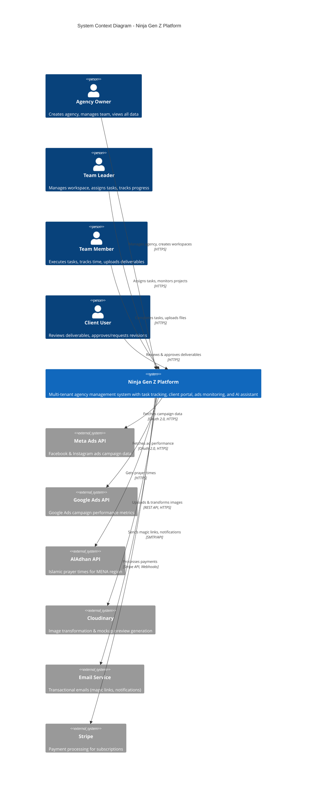

# C4 Architecture — Level 1: System Context Diagram

## Overview

The System Context diagram shows the Ninja Gen Z platform and how it interacts with users and external systems.

**Key Elements:**
- **Users:** Agency Owner, Team Leader, Team Member, Client, Guest
- **External Systems:** Meta Ads API, Google Ads API, AlAdhan Prayer Times API, Cloudinary, Email Service

---

## System Context Diagram



---

## User Personas

### 1. Agency Owner
**Role:** Admin/Superuser  
**Permissions:** Full access to agency data  
**Key Actions:**
- Create agency and workspaces
- Invite team members
- Assign roles (owner, team leader, member)
- View all projects and tasks
- Manage billing and subscriptions

### 2. Team Leader
**Role:** Manager  
**Permissions:** Workspace-scoped admin  
**Key Actions:**
- Create and assign tasks
- Monitor project progress
- Review team member work
- Manage workspace members
- Generate reports

### 3. Team Member
**Role:** Individual Contributor  
**Permissions:** Task-level access  
**Key Actions:**
- View assigned tasks
- Update task status
- Upload deliverables
- Comment on tasks
- Track work time

### 4. Client User
**Role:** External Stakeholder  
**Permissions:** Read-only + comment  
**Key Actions:**
- View project progress
- Review deliverables
- Approve or request revisions
- Add comments
- Download files

---

## External Systems Integration

### Meta Ads API
**Purpose:** Campaign monitoring  
**Data Flow:** Read-only  
**Sync Frequency:** Daily at 3:00 AM UTC  
**Authentication:** OAuth 2.0 (access + refresh tokens)  
**Rate Limit:** 200 calls/hour

### Google Ads API
**Purpose:** Ad performance tracking  
**Data Flow:** Read-only  
**Sync Frequency:** Daily at 3:30 AM UTC  
**Authentication:** OAuth 2.0  
**Rate Limit:** 15,000 operations/day

### AlAdhan Prayer Times API
**Purpose:** Prayer reminders for Muslim users  
**Data Flow:** Read-only  
**Sync Frequency:** Daily at 3:00 AM UTC  
**Authentication:** None (public API)  
**Caching:** 24 hours

### Cloudinary
**Purpose:** Mockup preview generation  
**Data Flow:** Upload images, receive transformed URLs  
**Authentication:** API Key  
**Use Case:** Platform-specific mockup templates (Instagram, Facebook, LinkedIn)

### Email Service (Resend/SendGrid)
**Purpose:** Transactional emails  
**Messages:**
- Magic link authentication
- Task assignment notifications
- Client approval requests
- Weekly summary reports

### Stripe
**Purpose:** Subscription billing  
**Plans:** Free, Starter, Pro, Enterprise  
**Integration:** Stripe Checkout + Webhooks  
**Data Sync:** Subscription status, payment history

---

## Data Flow Summary

```
User Authentication:
User → Platform (Email) → Email Service (Magic Link) → User (Click) → Platform (JWT)

Task Assignment:
Team Leader → Platform (Create Task) → Database (Store) → Realtime → Team Member (Notification)

Client Approval:
Client → Platform (Approve) → Database (Update status="done") → Realtime → Team (Notification)

Ads Monitoring:
Platform (Cron 3AM) → Meta API (Fetch campaigns) → Database (Store insights) → Dashboard (Display)

Prayer Reminders:
Platform (Cron 3AM) → AlAdhan API (Fetch times) → Database (Cache) → Browser (15-min alert)

Mockup Generation:
Team Member → Platform (Upload design) → Cloudinary (Transform) → Platform (Display preview)
```

---

## Security Boundaries

**External → Internal:**
- All external API calls over HTTPS/TLS 1.3
- OAuth tokens encrypted at rest (pgcrypto)
- API rate limiting enforced
- Webhook signature verification (Stripe)

**User → Platform:**
- JWT authentication (7-day expiry)
- RLS at database level
- CORS restricted to app domains
- CSP headers for XSS prevention

---

## Next: Level 2 - Container Diagram

See [C4-Level-2-Container.md](./C4-Level-2-Container.md) for detailed breakdown of system containers.
