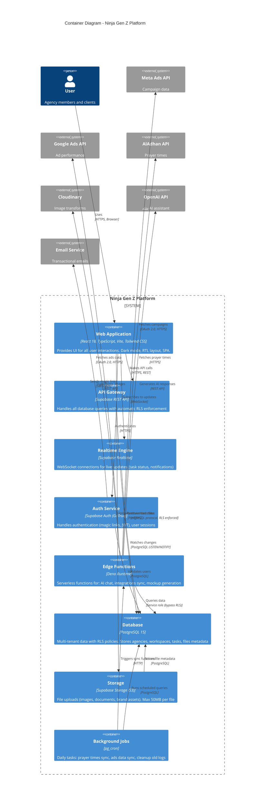

# C4 Architecture — Level 2: Container Diagram

## Overview

The Container diagram shows the high-level technology choices and how containers communicate with each other.

**Containers:**
- **Web Application (React SPA)** - Vite + TypeScript + Tailwind
- **API Gateway (Supabase)** - REST API + Realtime + Auth
- **Database (PostgreSQL)** - Multi-tenant with RLS
- **Storage (Supabase Storage)** - S3-compatible file storage
- **Edge Functions (Deno)** - Serverless backend logic
- **Background Jobs (pg_cron)** - Scheduled tasks

---

## Container Diagram



---

## Container Details

### 1. Web Application (Frontend)

**Technology Stack:**
- **Framework:** React 18 with Vite
- **Language:** TypeScript (strict mode)
- **Styling:** Tailwind CSS + Shadcn/ui
- **State Management:** Zustand + React Query
- **Routing:** React Router v6
- **Forms:** React Hook Form + Zod validation

**Key Features:**
- Dark mode by default (Gen Z aesthetic)
- RTL layout for Arabic
- Responsive (mobile-first)
- Code splitting & lazy loading
- PWA capabilities (Phase 2)

**Deployment:**
- **Platform:** Vercel
- **Build:** Vite production build
- **CDN:** Vercel Edge Network
- **SSL:** Automatic (Let's Encrypt)

**Performance Targets:**
- LCP < 2.5s
- FID < 100ms
- Bundle size < 500KB (gzip)

---

### 2. API Gateway (Supabase REST API)

**Responsibilities:**
- Automatic REST API generation from database schema
- RLS policy enforcement on every query
- Automatic OpenAPI documentation
- Built-in pagination, filtering, sorting

**Endpoints:**
```
GET    /rest/v1/tasks?workspace_id=eq.{id}
POST   /rest/v1/tasks
PATCH  /rest/v1/tasks?id=eq.{id}
DELETE /rest/v1/tasks?id=eq.{id}
```

**Authentication:**
- Header: `Authorization: Bearer {JWT}`
- JWT includes: `user_id`, `role`, `exp` (7 days)

**Rate Limiting:**
- Free tier: 100 requests/minute
- Pro tier: 500 requests/minute

---

### 3. Realtime Engine

**Technology:** Phoenix Framework (Elixir)

**Channels:**
- `public:tasks` - Task status updates
- `public:notifications` - User notifications
- `public:comments` - New comments

**Usage Example:**
```typescript
const channel = supabase
  .channel('public:tasks')
  .on('postgres_changes', {
    event: 'UPDATE',
    schema: 'public',
    table: 'tasks',
    filter: `workspace_id=eq.${workspaceId}`
  }, (payload) => {
    // Update UI with new task status
  })
  .subscribe();
```

**Performance:**
- Max 5,000 concurrent connections
- Message delivery < 1 second

---

### 4. Auth Service (Supabase Auth)

**Authentication Methods:**
- **Primary:** Magic Links (email)
- **Secondary:** Email/Password
- **OAuth:** Google (Phase 2)
- **SSO:** SAML (Phase 5, Enterprise)

**Session Management:**
- JWT expiry: 7 days
- Refresh token rotation
- Automatic token refresh before expiry

**Security:**
- Password hashing: bcrypt (cost 12)
- JWT signing: RS256 algorithm
- Rate limiting: 5 attempts/15 minutes

---

### 5. Edge Functions (Serverless Backend)

**Runtime:** Deno (TypeScript-first)

**Functions:**
```
POST /functions/v1/ai-chat           # سَنَد AI assistant
POST /functions/v1/sync-meta-ads     # Daily Meta Ads sync
POST /functions/v1/sync-google-ads  # Daily Google Ads sync
POST /functions/v1/generate-mockup   # Mockup preview generation
GET  /functions/v1/prayer-times      # Prayer times for today
POST /functions/v1/export-data       # GDPR data export
```

**Deployment:**
- Auto-deploy on Git push
- Cold start: < 500ms
- Max execution: 60 seconds

---

### 6. Database (PostgreSQL 15)

**Configuration:**
- **Version:** PostgreSQL 15.x
- **Extensions:** uuid-ossp, pgcrypto, pg_trgm, pg_cron
- **Connection Pool:** PgBouncer (max 200 connections)

**Key Tables:**
```
agencies (tenant root)
├── workspaces
│   ├── clients
│   │   ├── projects
│   │   │   └── tasks
│   │   │       ├── comments
│   │   │       └── files
│   │   └── brand_kits
│   └── user_workspace_access
└── user_roles
```

**RLS Policies:**
- All queries filtered by `agency_id` or `workspace_id`
- Service role bypasses RLS (Edge Functions only)

**Performance:**
- Indexes on all foreign keys
- Materialized views for analytics (Phase 2)
- Query timeout: 30 seconds

---

### 7. Storage (Supabase Storage)

**Backend:** S3-compatible (AWS S3)

**Buckets:**
```
avatars/        # User profile pictures
brand-assets/   # Client logos, fonts, colors
task-files/     # Deliverables (images, PDFs, videos)
mockups/        # Generated mockup previews
```

**Rules:**
- Max file size: 50MB
- Allowed types: images (JPEG, PNG, WebP), PDFs, videos (MP4)
- Virus scanning: Enabled
- Versioning: 30 days retention

**Access Control:**
- Public read for approved files
- Authenticated upload
- RLS policies on file metadata table

---

### 8. Background Jobs (pg_cron)

**Scheduled Tasks:**

```sql
-- Daily prayer times sync (3:00 AM UTC)
SELECT cron.schedule('sync-prayer-times', '0 3 * * *', 
  $$SELECT net.http_post('https://project.supabase.co/functions/v1/sync-prayer-times')$$
);

-- Daily Meta Ads sync (3:00 AM UTC)
SELECT cron.schedule('sync-meta-ads', '0 3 * * *',
  $$SELECT net.http_post('https://project.supabase.co/functions/v1/sync-meta-ads')$$
);

-- Delete old activity logs (weekly, Sunday 2:00 AM)
SELECT cron.schedule('cleanup-logs', '0 2 * * 0',
  $$DELETE FROM activity_logs WHERE created_at < NOW() - INTERVAL '2 years'$$
);
```

---

## Data Flow Examples

### Task Status Update (Realtime)

```
1. Team Member updates task status (todo → in_progress)
   ↓
2. Web App → API Gateway (PATCH /tasks)
   ↓
3. API Gateway → Database (UPDATE tasks SET status='in_progress')
   ↓
4. Database → Trigger (log_task_changes)
   ↓
5. Database → INSERT activity_logs
   ↓
6. Database → NOTIFY (realtime channel)
   ↓
7. Realtime Engine → WebSocket broadcast
   ↓
8. Web App receives update → UI refreshes
```

### AI Chat (سَنَد Assistant)

```
1. User types message in chat
   ↓
2. Web App → Edge Function (POST /ai-chat)
   ↓
3. Edge Function → Database (fetch context: recent tasks, workspace info)
   ↓
4. Edge Function → OpenAI API (send prompt + context)
   ↓
5. OpenAI → Edge Function (AI response)
   ↓
6. Edge Function → Web App (JSON response)
   ↓
7. Web App displays AI message
```

---

## Security Architecture

### Network Security
- All traffic over HTTPS/TLS 1.3
- HSTS headers (max-age: 31536000)
- CSP headers to prevent XSS

### Authentication Flow
```
User → Web App (enter email)
Web App → Auth Service (signUp/signIn)
Auth Service → Email Service (send magic link)
User → Email (click link)
Auth Service → validate token → issue JWT
Web App → store JWT in localStorage
Web App → API Gateway (include JWT in headers)
API Gateway → validate JWT → execute query
```

### Authorization (RLS)
- Database enforces RLS on all queries
- JWT claims include `user_id`, `role`
- Policies check: `auth.uid() = user_id` or role-based

---

## Deployment Architecture

```
Vercel (Frontend)
├── CDN (Global edge)
├── Build: Vite production
└── Environment variables

Supabase (Backend)
├── API Gateway (Auto-scaled)
├── Realtime (Phoenix)
├── Auth Service (GoTrue)
├── Database (PostgreSQL)
│   ├── Primary (Virginia, US)
│   └── Point-in-time backups
├── Storage (S3)
└── Edge Functions (Deno)
```

**Regions:**
- **Frontend:** Global (Vercel Edge)
- **Backend:** us-east-1 (Supabase primary)
- **Backups:** Daily snapshots (30-day retention)

---

## Next: Level 3 - Component Diagrams

See component-level diagrams for:
- [Frontend Components](./C4-Level-3-Frontend-Components.md)
- [Edge Functions Components](./C4-Level-3-Edge-Functions.md)
- [Database Components](./C4-Level-3-Database-Components.md)
