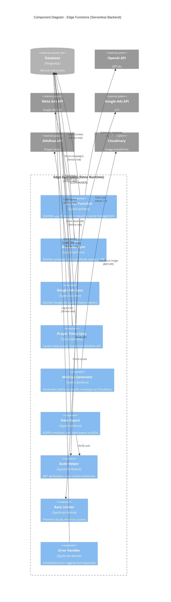

# C4 Architecture — Level 3: Edge Functions Components

## Overview

This diagram shows the component-level architecture of **Edge Functions (Serverless Backend)**.

**Key Functions:**
- **AI Chat** - سَنَد AI assistant (OpenAI integration)
- **Meta Ads Sync** - Daily campaign data sync
- **Google Ads Sync** - Ad performance sync
- **Prayer Times Sync** - AlAdhan API integration
- **Mockup Generator** - Cloudinary image transformation
- **Data Export** - GDPR compliance

---

## Edge Functions Component Diagram



---

## Function Details

### 1. AI Chat Function (سَنَد Assistant)

**Endpoint:** `POST /functions/v1/ai-chat`

**Purpose:** Provides AI-powered assistance for agency workflows

**Features:**
- Task suggestions
- Meeting summaries
- Quick answers about platform features

**Code:**
```typescript
// supabase/functions/ai-chat/index.ts
import { serve } from 'https://deno.land/std@0.168.0/http/server.ts';
import { createClient } from '@supabase/supabase-js';

serve(async (req) => {
  const { message, workspace_id } = await req.json();
  
  // 1. Verify JWT
  const authHeader = req.headers.get('Authorization');
  const token = authHeader?.replace('Bearer ', '');
  
  const supabase = createClient(
    Deno.env.get('SUPABASE_URL')!,
    Deno.env.get('SUPABASE_SERVICE_ROLE_KEY')!
  );
  
  const { data: { user }, error: authError } = await supabase.auth.getUser(token);
  if (authError || !user) {
    return new Response('Unauthorized', { status: 401 });
  }
  
  // 2. Check quota (50 messages/month for Basic, unlimited for Pro)
  const { data: userRole } = await supabase
    .from('user_roles')
    .select('role, agency:agencies(plan)')
    .eq('user_id', user.id)
    .single();
  
  if (userRole?.agency?.plan === 'basic') {
    const { count } = await supabase
      .from('ai_chat_history')
      .select('*', { count: 'exact', head: true })
      .eq('user_id', user.id)
      .gte('created_at', new Date(new Date().getFullYear(), new Date().getMonth(), 1).toISOString());
    
    if (count && count >= 50) {
      return new Response(JSON.stringify({
        error: 'تجاوزت حد الرسائل الشهرية (50 رسالة)',
        upgrade_url: '/upgrade'
      }), { status: 429 });
    }
  }
  
  // 3. Fetch context (recent tasks, workspace info)
  const { data: recentTasks } = await supabase
    .from('tasks')
    .select('title, status, deadline')
    .eq('workspace_id', workspace_id)
    .order('created_at', { ascending: false })
    .limit(5);
  
  // 4. Call OpenAI
  const openAIResponse = await fetch('https://api.openai.com/v1/chat/completions', {
    method: 'POST',
    headers: {
      'Authorization': `Bearer ${Deno.env.get('OPENAI_API_KEY')}`,
      'Content-Type': 'application/json'
    },
    body: JSON.stringify({
      model: 'gpt-4o',
      messages: [
        {
          role: 'system',
          content: `أنت "سَنَد"، مساعد ذكي لمنصة Ninja Gen Z. السياق: آخر 5 مهام: ${JSON.stringify(recentTasks)}`
        },
        {
          role: 'user',
          content: message
        }
      ],
      max_tokens: 500,
      temperature: 0.7
    })
  });
  
  const aiData = await openAIResponse.json();
  const aiMessage = aiData.choices[0].message.content;
  
  // 5. Store chat history
  await supabase.from('ai_chat_history').insert({
    user_id: user.id,
    workspace_id,
    user_message: message,
    ai_response: aiMessage
  });
  
  return new Response(JSON.stringify({ response: aiMessage }), {
    headers: { 'Content-Type': 'application/json' }
  });
});
```

---

### 2. Meta Ads Sync Function

**Endpoint:** `POST /functions/v1/sync-meta-ads` (triggered by cron)

**Purpose:** Daily sync of campaign data from Meta Ads API

**Flow:**
```
1. Get all agencies with Meta integration
2. For each agency:
   a. Refresh OAuth token if needed
   b. Fetch ad accounts
   c. Fetch campaigns
   d. Fetch insights (last 7 days)
   e. Store in database
3. Send summary notification to team leaders
```

**Code:**
```typescript
// supabase/functions/sync-meta-ads/index.ts
serve(async (req) => {
  const supabase = createClient(
    Deno.env.get('SUPABASE_URL')!,
    Deno.env.get('SUPABASE_SERVICE_ROLE_KEY')!
  );
  
  // 1. Get agencies with Meta integration
  const { data: integrations } = await supabase
    .from('oauth_tokens')
    .select('*, agency:agencies(id, name)')
    .eq('provider', 'meta')
    .eq('is_active', true);
  
  for (const integration of integrations || []) {
    try {
      // 2. Refresh token if expiring soon
      if (isTokenExpiringSoon(integration.expires_at)) {
        const newToken = await refreshMetaToken(integration.refresh_token);
        await supabase
          .from('oauth_tokens')
          .update({
            access_token: newToken.access_token,
            expires_at: new Date(Date.now() + newToken.expires_in * 1000)
          })
          .eq('id', integration.id);
      }
      
      // 3. Fetch campaigns
      const campaigns = await fetchMetaCampaigns(integration.access_token);
      
      // 4. Store in database
      for (const campaign of campaigns) {
        await supabase.from('meta_campaigns').upsert({
          agency_id: integration.agency_id,
          campaign_id: campaign.id,
          name: campaign.name,
          status: campaign.status,
          objective: campaign.objective
        });
        
        // 5. Fetch insights
        const insights = await fetchCampaignInsights(
          campaign.id,
          integration.access_token
        );
        
        await supabase.from('meta_campaign_insights').insert({
          campaign_id: campaign.id,
          date: new Date().toISOString().split('T')[0],
          spend: insights.spend,
          impressions: insights.impressions,
          clicks: insights.clicks,
          conversions: insights.conversions
        });
      }
      
    } catch (error) {
      console.error(`Failed to sync Meta ads for agency ${integration.agency_id}:`, error);
      
      // Log error for review
      await supabase.from('integration_errors').insert({
        agency_id: integration.agency_id,
        provider: 'meta',
        error_message: error.message
      });
    }
  }
  
  return new Response('Sync completed', { status: 200 });
});
```

---

### 3. Prayer Times Sync Function

**Endpoint:** `POST /functions/v1/sync-prayer-times` (cron: daily 3 AM)

**Purpose:** Cache prayer times from AlAdhan API

**Code:**
```typescript
// supabase/functions/sync-prayer-times/index.ts
serve(async (req) => {
  const supabase = createClient(
    Deno.env.get('SUPABASE_URL')!,
    Deno.env.get('SUPABASE_SERVICE_ROLE_KEY')!
  );
  
  // Get list of cities from user settings
  const { data: cities } = await supabase
    .from('prayer_settings')
    .select('city, country')
    .neq('enabled', false);
  
  const uniqueCities = [...new Set(cities?.map(c => `${c.city},${c.country}`))];
  
  for (const location of uniqueCities) {
    const [city, country] = location.split(',');
    
    try {
      // Fetch from AlAdhan API
      const response = await fetch(
        `https://api.aladhan.com/v1/timingsByCity?city=${city}&country=${country}&method=5`
      );
      const data = await response.json();
      
      if (data.code === 200) {
        const timings = data.data.timings;
        
        // Store in database
        await supabase.from('prayer_times_cache').upsert({
          city,
          country,
          date: new Date().toISOString().split('T')[0],
          fajr: timings.Fajr,
          dhuhr: timings.Dhuhr,
          asr: timings.Asr,
          maghrib: timings.Maghrib,
          isha: timings.Isha
        });
      }
    } catch (error) {
      console.error(`Failed to fetch prayer times for ${city}, ${country}:`, error);
    }
  }
  
  return new Response('Prayer times synced', { status: 200 });
});
```

---

### 4. Mockup Generator Function

**Endpoint:** `POST /functions/v1/generate-mockup`

**Purpose:** Generate platform-specific mockups using Cloudinary

**Request:**
```json
{
  "image_url": "https://storage.supabase.co/...",
  "platform": "instagram_post",
  "task_id": "uuid"
}
```

**Code:**
```typescript
// supabase/functions/generate-mockup/index.ts
const TEMPLATES = {
  instagram_post: {
    width: 1080,
    height: 1080,
    overlay: 'instagram_frame_v1'
  },
  instagram_story: {
    width: 1080,
    height: 1920,
    overlay: 'instagram_story_frame_v1'
  },
  facebook_post: {
    width: 1200,
    height: 630,
    overlay: 'facebook_frame_v1'
  }
};

serve(async (req) => {
  const { image_url, platform, task_id } = await req.json();
  
  const template = TEMPLATES[platform];
  if (!template) {
    return new Response('Invalid platform', { status: 400 });
  }
  
  // Transform image with Cloudinary
  const cloudinaryUrl = `https://res.cloudinary.com/${Deno.env.get('CLOUDINARY_CLOUD_NAME')}/image/upload/w_${template.width},h_${template.height},c_fill,g_center/${template.overlay}/${image_url}`;
  
  // Store mockup URL in database
  const supabase = createClient(
    Deno.env.get('SUPABASE_URL')!,
    Deno.env.get('SUPABASE_SERVICE_ROLE_KEY')!
  );
  
  await supabase.from('mockup_previews').insert({
    task_id,
    platform,
    preview_url: cloudinaryUrl,
    original_url: image_url
  });
  
  return new Response(JSON.stringify({ preview_url: cloudinaryUrl }), {
    headers: { 'Content-Type': 'application/json' }
  });
});
```

---

### 5. Data Export Function (GDPR)

**Endpoint:** `POST /functions/v1/export-data`

**Purpose:** Export all user data in JSON format

**Code:**
```typescript
// supabase/functions/export-data/index.ts
serve(async (req) => {
  const authHeader = req.headers.get('Authorization');
  const token = authHeader?.replace('Bearer ', '');
  
  const supabase = createClient(
    Deno.env.get('SUPABASE_URL')!,
    Deno.env.get('SUPABASE_SERVICE_ROLE_KEY')!
  );
  
  const { data: { user } } = await supabase.auth.getUser(token);
  if (!user) {
    return new Response('Unauthorized', { status: 401 });
  }
  
  // Fetch all user data
  const [profile, tasks, comments, activityLogs] = await Promise.all([
    supabase.from('user_profiles').select('*').eq('id', user.id).single(),
    supabase.from('tasks').select('*').eq('assigned_to', user.id),
    supabase.from('comments').select('*').eq('user_id', user.id),
    supabase.from('activity_logs').select('*').eq('user_id', user.id)
  ]);
  
  const exportData = {
    user: {
      id: user.id,
      email: user.email,
      created_at: user.created_at
    },
    profile: profile.data,
    tasks: tasks.data,
    comments: comments.data,
    activity_logs: activityLogs.data,
    exported_at: new Date().toISOString()
  };
  
  return new Response(JSON.stringify(exportData, null, 2), {
    headers: {
      'Content-Type': 'application/json',
      'Content-Disposition': `attachment; filename="user_data_${user.id}.json"`
    }
  });
});
```

---

## Shared Modules

### Auth Helper

```typescript
// supabase/functions/_shared/auth.ts
export async function verifyJWT(authHeader: string | null): Promise<User | null> {
  if (!authHeader) return null;
  
  const token = authHeader.replace('Bearer ', '');
  const supabase = createClient(
    Deno.env.get('SUPABASE_URL')!,
    Deno.env.get('SUPABASE_SERVICE_ROLE_KEY')!
  );
  
  const { data: { user }, error } = await supabase.auth.getUser(token);
  return error ? null : user;
}
```

### Rate Limiter

```typescript
// supabase/functions/_shared/rateLimiter.ts
export async function checkRateLimit(
  userId: string,
  endpoint: string,
  maxRequests: number,
  windowMs: number
): Promise<boolean> {
  const supabase = createClient(
    Deno.env.get('SUPABASE_URL')!,
    Deno.env.get('SUPABASE_SERVICE_ROLE_KEY')!
  );
  
  const windowStart = new Date(Date.now() - windowMs);
  
  const { count } = await supabase
    .from('rate_limit_log')
    .select('*', { count: 'exact', head: true })
    .eq('user_id', userId)
    .eq('endpoint', endpoint)
    .gte('created_at', windowStart.toISOString());
  
  if (count && count >= maxRequests) {
    return false; // Rate limit exceeded
  }
  
  // Log request
  await supabase.from('rate_limit_log').insert({
    user_id: userId,
    endpoint,
    created_at: new Date().toISOString()
  });
  
  return true;
}
```

---

## Deployment

**Auto-Deploy:**
```bash
# Deploy all functions
supabase functions deploy

# Deploy specific function
supabase functions deploy ai-chat
```

**Environment Variables:**
```bash
# Set secrets
supabase secrets set OPENAI_API_KEY=sk-...
supabase secrets set CLOUDINARY_CLOUD_NAME=ninja-gen-z
supabase secrets set META_APP_SECRET=...
```

---

## Next: Database Components

See [C4-Level-3-Database-Components.md](./C4-Level-3-Database-Components.md) for database architecture.
