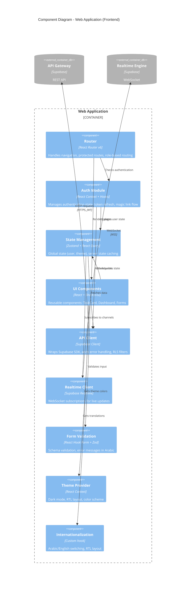

# C4 Architecture — Level 3: Frontend Components

## Overview

This diagram shows the component-level architecture of the **Web Application (React SPA)**.

**Key Components:**
- **Routing** - React Router with protected routes
- **State Management** - Zustand stores + React Query cache
- **UI Components** - Shadcn/ui library + custom components
- **API Client** - Supabase client wrapper
- **Auth Module** - Authentication logic & token management

---

## Frontend Component Diagram



---

## Component Details

### 1. Router (React Router v6)

**Responsibilities:**
- Client-side routing
- Protected route guards
- Role-based access control
- Lazy loading for code splitting

**Route Structure:**
```typescript
<Routes>
  <Route path="/" element={<LandingPage />} />
  <Route path="/login" element={<LoginPage />} />
  
  {/* Protected routes */}
  <Route element={<ProtectedRoute />}>
    <Route path="/dashboard" element={<Dashboard />} />
    <Route path="/tasks" element={<TasksList />} />
    <Route path="/projects/:id" element={<ProjectDetail />} />
    <Route path="/settings" element={<Settings />} />
  </Route>
  
  {/* Admin-only routes */}
  <Route element={<ProtectedRoute requiredRole="owner" />}>
    <Route path="/admin/users" element={<UserManagement />} />
    <Route path="/admin/billing" element={<Billing />} />
  </Route>
</Routes>
```

**Code Example:**
```typescript
// src/router/ProtectedRoute.tsx
function ProtectedRoute({ requiredRole }: { requiredRole?: string }) {
  const { user, role } = useAuth();
  
  if (!user) return <Navigate to="/login" />;
  if (requiredRole && role !== requiredRole) return <Navigate to="/dashboard" />;
  
  return <Outlet />;
}
```

---

### 2. Auth Module

**Components:**
- `AuthProvider.tsx` - Context provider
- `useAuth.ts` - Authentication hook
- `LoginPage.tsx` - Magic link UI
- `OnboardingWizard.tsx` - New user setup

**State:**
```typescript
interface AuthState {
  user: User | null;
  session: Session | null;
  role: 'owner' | 'team_leader' | 'member' | 'client' | null;
  loading: boolean;
  signIn: (email: string) => Promise<void>;
  signOut: () => Promise<void>;
}
```

**Magic Link Flow:**
```typescript
// src/lib/auth.ts
export async function sendMagicLink(email: string) {
  const { error } = await supabase.auth.signInWith OTP({
    email,
    options: {
      emailRedirectTo: `${window.location.origin}/auth/callback`
    }
  });
  
  if (error) throw error;
}
```

---

### 3. State Management

**Zustand Stores:**

```typescript
// src/stores/userStore.ts
export const useUserStore = create<UserStore>((set) => ({
  user: null,
  agency: null,
  workspaces: [],
  setUser: (user) => set({ user }),
  setAgency: (agency) => set({ agency }),
}));

// src/stores/themeStore.ts
export const useThemeStore = create<ThemeStore>((set) => ({
  theme: 'dark',
  language: 'ar',
  setTheme: (theme) => set({ theme }),
  setLanguage: (lang) => set({ language: lang }),
}));
```

**React Query Cache:**
```typescript
// src/lib/queryClient.ts
export const queryClient = new QueryClient({
  defaultOptions: {
    queries: {
      staleTime: 5 * 60 * 1000, // 5 minutes
      cacheTime: 10 * 60 * 1000, // 10 minutes
      refetchOnWindowFocus: false,
    },
  },
});

// Usage
const { data: tasks } = useQuery({
  queryKey: ['tasks', workspaceId],
  queryFn: () => getWorkspaceTasks(workspaceId),
});
```

---

### 4. UI Components

**Component Library Structure:**
```
src/components/
├── ui/                    # Shadcn/ui base (Button, Card, Input)
├── layout/                # Layout components (Sidebar, Header)
├── task-card/             # Task components
│   ├── TaskCard.tsx
│   ├── TaskStatusBadge.tsx
│   └── TaskForm.tsx
├── dashboard/             # Dashboard widgets
│   ├── StatsCard.tsx
│   ├── RecentTasks.tsx
│   └── UpcomingDeadlines.tsx
└── forms/                 # Form components
    ├── ClientForm.tsx
    └── ProjectForm.tsx
```

**Example Component:**
```typescript
// src/components/task-card/TaskCard.tsx
import { Card } from '@/components/ui/card';
import { Badge } from '@/components/ui/badge';

interface TaskCardProps {
  task: Task;
  onEdit: (task: Task) => void;
}

export function TaskCard({ task, onEdit }: TaskCardProps) {
  const isOverdue = task.deadline && new Date(task.deadline) < new Date();
  
  return (
    <Card className="hover:shadow-lg transition-all duration-150">
      <div className="flex justify-between items-start p-4">
        <div>
          <h3 className="text-lg font-semibold">{task.title}</h3>
          <p className="text-sm text-muted-foreground mt-1">
            {task.description}
          </p>
        </div>
        <Badge variant={isOverdue ? 'destructive' : 'default'}>
          {task.status}
        </Badge>
      </div>
    </Card>
  );
}
```

---

### 5. API Client

**Supabase Client Wrapper:**
```typescript
// src/lib/supabase/client.ts
import { createClient } from '@supabase/supabase-js';
import type { Database } from '@/types/database.types';

export const supabase = createClient<Database>(
  import.meta.env.VITE_SUPABASE_URL,
  import.meta.env.VITE_SUPABASE_ANON_KEY
);

// Query example with RLS filter
export async function getWorkspaceTasks(workspaceId: string) {
  const { data, error } = await supabase
    .from('tasks')
    .select(`
      *,
      assignee:users(id, full_name, avatar_url),
      project:projects(id, name)
    `)
    .eq('workspace_id', workspaceId)
    .order('created_at', { ascending: false });
  
  if (error) {
    console.error('Error fetching tasks:', error);
    throw new Error('فشل تحميل المهام');
  }
  
  return data;
}
```

---

### 6. Realtime Client

**Subscriptions:**
```typescript
// src/hooks/useRealtimeTasks.ts
export function useRealtimeTasks(workspaceId: string) {
  const queryClient = useQueryClient();
  
  useEffect(() => {
    const channel = supabase
      .channel('public:tasks')
      .on('postgres_changes', {
        event: '*',
        schema: 'public',
        table: 'tasks',
        filter: `workspace_id=eq.${workspaceId}`
      }, (payload) => {
        // Invalidate React Query cache
        queryClient.invalidateQueries(['tasks', workspaceId]);
      })
      .subscribe();
    
    return () => {
      supabase.removeChannel(channel);
    };
  }, [workspaceId]);
}
```

---

### 7. Form Validation (Zod)

**Schema Example:**
```typescript
// src/schemas/taskSchema.ts
import { z } from 'zod';

export const createTaskSchema = z.object({
  title: z.string()
    .min(3, 'العنوان يجب أن يكون 3 أحرف على الأقل')
    .max(200, 'العنوان طويل جداً'),
  
  description: z.string().max(5000).optional(),
  
  project_id: z.string().uuid('المشروع مطلوب'),
  
  assigned_to: z.string().uuid().optional(),
  
  status: z.enum(['todo', 'in_progress', 'review', 'done'])
    .default('todo'),
  
  priority: z.enum(['high', 'medium', 'low'])
    .default('medium'),
  
  deadline: z.string().datetime().optional(),
});

// Usage in form
const form = useForm({
  resolver: zodResolver(createTaskSchema),
});
```

---

### 8. Theme Provider

**Dark Mode + RTL:**
```typescript
// src/components/ThemeProvider.tsx
export function ThemeProvider({ children }: { children: React.Node }) {
  const [theme, setTheme] = useState<'dark' | 'light'>('dark');
  const [language, setLanguage] = useState<'ar' | 'en'>('ar');
  
  useEffect(() => {
    document.documentElement.classList.toggle('dark', theme === 'dark');
    document.documentElement.dir = language === 'ar' ? 'rtl' : 'ltr';
    document.documentElement.lang = language;
  }, [theme, language]);
  
  return (
    <ThemeContext.Provider value={{ theme, setTheme, language, setLanguage }}>
      {children}
    </ThemeContext.Provider>
  );
}
```

---

## Component Interactions

### Task Creation Flow

```
1. User fills form (UI Components)
   ↓
2. Form Validation validates input (Zod)
   ↓
3. Form submits to API Client
   ↓
4. API Client → POST /tasks (API Gateway)
   ↓
5. Success → State Management updates cache (React Query)
   ↓
6. Realtime Client receives INSERT event
   ↓
7. UI Components re-render with new task
```

---

## Performance Optimizations

**Code Splitting:**
```typescript
const Dashboard = lazy(() => import('@/pages/Dashboard'));
const TasksList = lazy(() => import('@/pages/TasksList'));
const ProjectDetail = lazy(() => import('@/pages/ProjectDetail'));
```

**Memoization:**
```typescript
const filteredTasks = useMemo(() => {
  return tasks.filter((task) => task.status === filter);
}, [tasks, filter]);
```

**Virtual Scrolling:**
```typescript
import { useVirtualizer } from '@tanstack/react-virtual';

// For large task lists (> 100 items)
const virtualizer = useVirtualizer({
  count: tasks.length,
  getScrollElement: () => scrollRef.current,
  estimateSize: () => 80,
});
```

---

## Next: Edge Functions Components

See [C4-Level-3-Edge-Functions.md](./C4-Level-3-Edge-Functions.md) for serverless backend components.
