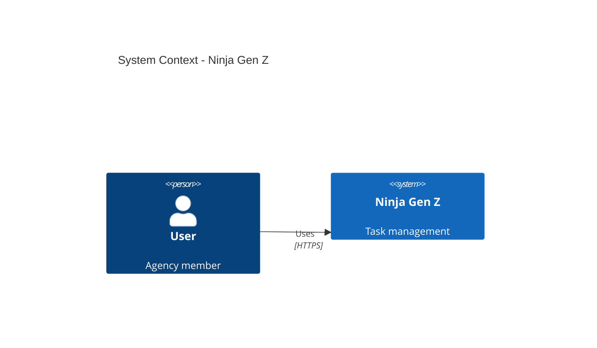

# C4 Architecture Diagrams — Ninja Gen Z Platform

## Overview

This folder contains the complete **C4 Model** architecture diagrams for the Ninja Gen Z platform. The C4 model provides a hierarchical view of the system architecture, from high-level context down to code-level implementation details.

**Created:** 2026-01-24  
**Diagrams:** 6 documents (4 levels + specialized views)  
**Format:** Mermaid diagrams + detailed documentation

---

## C4 Model Levels

### Level 1: System Context
**File:** [C4-Level-1-Context.md](./C4-Level-1-Context.md)

**Scope:** The big picture — system and external actors  
**Audience:** Everyone (executives, stakeholders, developers)

**Shows:**
- 4 user personas (Agency Owner, Team Leader, Member, Client)
- Ninja Gen Z platform (black box)
- 6 external systems (Meta API, Google API, AlAdhan, Cloudinary, Email, Stripe)
- High-level interactions and data flows

**Key Diagram:**
- System context with users and external systems
- Authentication flow
- Data sync patterns

---

### Level 2: Container Diagram
**File:** [C4-Level-2-Container.md](./C4-Level-2-Container.md)

**Scope:** System decomposition — major containers  
**Audience:** Technical stakeholders, architects, senior developers

**Shows:**
- 8 containers:
  1. Web Application (React SPA)
  2. API Gateway (Supabase REST)
  3. Realtime Engine (Phoenix/Elixir)
  4. Auth Service (GoTrue)
  5. Edge Functions (Deno)
  6. Database (PostgreSQL 15)
  7. Storage (S3-compatible)
  8. Background Jobs (pg_cron)

**Key Details:**
- Technology stack for each container
- Communication protocols (HTTPS, WebSocket, PostgreSQL)
- Deployment architecture (Vercel + Supabase)

---

### Level 3: Component Diagrams

#### Frontend Components
**File:** [C4-Level-3-Frontend-Components.md](./C4-Level-3-Frontend-Components.md)

**Scope:** React SPA internal architecture  
**Audience:** Frontend developers

**Shows:**
- 9 major components:
  1. Router (React Router v6)
  2. Auth Module (Context + Hooks)
  3. State Management (Zustand + React Query)
  4. UI Components (Shadcn/ui)
  5. API Client (Supabase SDK wrapper)
  6. Realtime Client (WebSocket subscriptions)
  7. Form Validation (React Hook Form + Zod)
  8. Theme Provider (Dark mode + RTL)
  9. Internationalization (Arabic/English)

**Includes:**
- Code examples for each component
- Data flow diagrams
- Performance optimizations (code splitting, memoization)

---

#### Edge Functions Components
**File:** [C4-Level-3-Edge-Functions.md](./C4-Level-3-Edge-Functions.md)

**Scope:** Serverless backend functions  
**Audience:** Backend developers

**Shows:**
- 6 Edge Functions:
  1. AI Chat Function (سَنَد assistant)
  2. Meta Ads Sync
  3. Google Ads Sync
  4. Prayer Times Sync
  5. Mockup Generator
  6. Data Export (GDPR)

**Includes:**
- Complete TypeScript/Deno code for each function
- OAuth integration patterns
- Rate limiting implementation
- Error handling strategies

---

### Level 4: Code Diagram
**File:** [C4-Level-4-Code-RLS.md](./C4-Level-4-Code-RLS.md)

**Scope:** Critical code implementation — RLS enforcement  
**Audience:** Senior developers, security team

**Shows:**
- Row Level Security (RLS) policy implementation
- JWT validation flow
- Cross-tenant attack prevention
- Service role bypass pattern
- Activity logging triggers

**Includes:**
- Complete SQL policies
- Sequence diagram for RLS enforcement
- Attack scenario and mitigation
- Performance optimization indexes

---

## Diagram Format

All diagrams use **Mermaid** syntax for easy maintenance and version control.

**Viewing Options:**
1. **VS Code:** Install "Markdown Preview Mermaid Support" extension
2. **GitHub:** Native Mermaid rendering
3. **mermaid.live:** Copy-paste code for testing
4. **Export:** Use Mermaid CLI to export as PNG/SVG

**Example:**


---

## Usage Guidelines

### For Onboarding New Developers
**Recommended Reading Order:**
1. Start with [Level 1: Context](./C4-Level-1-Context.md) — Understand the problem space
2. Read [Level 2: Container](./C4-Level-2-Container.md) — Learn technology choices
3. Dive into [Level 3: Frontend](./C4-Level-3-Frontend-Components.md) or [Backend](./C4-Level-3-Edge-Functions.md) based on your role
4. Study [Level 4: RLS](./C4-Level-4-Code-RLS.md) if working on security-critical features

### For Stakeholders / Non-Technical
- **Read:** Level 1 only
- **Focus on:** User personas, external integrations, high-level flows

### For Technical Interviews
- **Show:** Level 2 (Container) + Level 3 (your domain)
- **Discuss:** Technology choices, scalability, security

---

## Maintenance

**Update Triggers:**
- ✅ New external API integration → Update Level 1
- ✅ New container (e.g., Redis cache) → Update Level 2
- ✅ New React component pattern → Update Level 3 Frontend
- ✅ New RLS policy → Update Level 4

**Review Schedule:**
- **Monthly:** Quick review for staleness
- **Quarterly:** Full audit and updates
- **Per Phase:** Update after each major release (Phase 2, 3, etc.)

---

## Related Documentation

**System Architecture:**
- [System Architecture Document](../System%20Architecture/System%20Architecture.md)
- [DevOps & Infrastructure](../System%20Architecture/DevOps%20&%20Infrastructure%20Document.md)

**Database:**
- [Database Design Document](../Technical%20Documentation/Database-Design-Document.md)
- [Multi-Tenancy Design](../Technical%20Documentation/Multi-Tenancy-Design-Document.md)

**Security:**
- [Security & Compliance](../Technical%20Documentation/Security-Compliance-Document.md)

**Integrations:**
- [Integration Specifications](../Technical%20Documentation/Integration-Specifications.md)

---

## Export Diagrams

**To PNG:**
```bash
# Install Mermaid CLI
npm install -g @mermaid-js/mermaid-cli

# Export diagram
mmdc -i C4-Level-1-Context.md -o diagrams/context.png
```

**To SVG (vector):**
```bash
mmdc -i C4-Level-2-Container.md -o diagrams/container.svg
```

---

## Contact

**Questions about architecture?**
- Technical Lead: [tech@ninjagenzy.com]
- Documentation: [docs@ninjagenzy.com]

**Suggest improvements:**
- Create GitHub issue with label "architecture"
- Submit PR with diagram updates

---

## Changelog

- **v1.0** (2026-01-24): Initial C4 diagrams created
  - Level 1: System Context ✅
  - Level 2: Container Diagram ✅
  - Level 3: Frontend Components ✅
  - Level 3: Edge Functions ✅
  - Level 4: RLS Code Diagram ✅
  - README index created ✅
