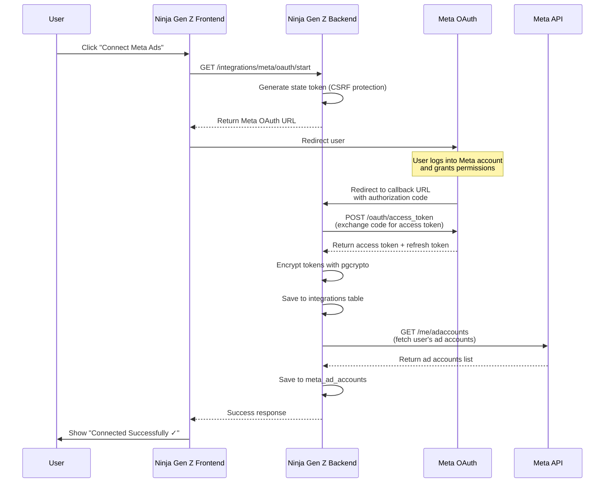
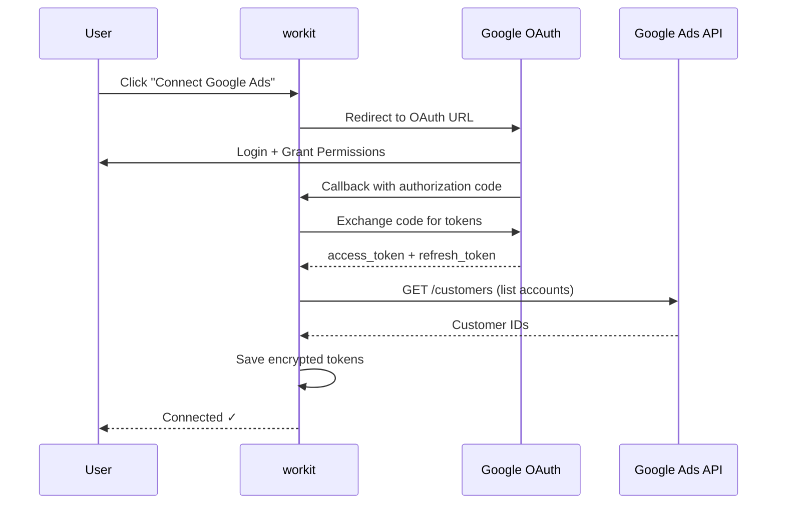

# Integration Specifications Document — Ninja Gen Z Platform

## TL;DR

This document specifies all external API integrations for the Ninja Gen Z platform. It includes **4 critical integrations**: Meta Marketing API (Facebook/Instagram ads monitoring), Google Ads API (search/display ads monitoring), AlAdhan API (Islamic prayer times for MENA region), and Cloudinary (mockup preview generation). Each integration includes OAuth 2.0 flow diagrams, required permissions, endpoint specifications, data mapping, rate limits, error handling, and webhook configurations. All API credentials are encrypted using `pgcrypto` and stored in Supabase with RLS policies.

---

## Table of Contents

- [1. Integration Overview](#1-integration-overview)
- [2. Meta Marketing API (Facebook/Instagram Ads)](#2-meta-marketing-api-facebookinstagram-ads)
- [3. Google Ads API](#3-google-ads-api)
- [4. AlAdhan Prayer Times API](#4-aladhan-prayer-times-api)
- [5. Cloudinary (Mockup Preview System)](#5-cloudinary-mockup-preview-system)
- [6. Security Considerations](#6-security-considerations)
- [7. Error Handling and Retry Logic](#7-error-handling-and-retry-logic)
- [8. Next Steps](#8-next-steps)
- [9. References](#9-references)
- [10. Changelog](#10-changelog)

---

## 1. Integration Overview

###  1.1 Integration Summary Table

| Integration | Purpose | Phase | Auth Method | Rate Limit | Data Sync |
|:------------|:--------|:------|:------------|:-----------|:----------|
| **Meta Marketing API** | Monitor Facebook/Instagram ad campaigns | Phase 4 | OAuth 2.0 | 200 calls/hour/user | Every 6h (automated) |
| **Google Ads API** | Monitor Google search/display ads | Phase 4 | OAuth 2.0 | 15,000 ops/day | Every 6h (automated) |
| **AlAdhan API** | Fetch daily prayer times by city | Phase 3 | No auth (public) | Unlimited | Daily at 3:00 AM |
| **Cloudinary** | Generate platform-specific mockup previews | Phase 4 | API Key | 25k transformations/month | On-demand |

### 1.2 Database Tables for Integrations

```sql
-- Store encrypted API credentials
CREATE TABLE integrations (
  id UUID PRIMARY KEY DEFAULT uuid_generate_v4(),
  agency_id UUID REFERENCES agencies(id) ON DELETE CASCADE NOT NULL,
  integration_type TEXT CHECK (integration_type IN ('meta_ads', 'google_ads', 'cloudinary')) NOT NULL,
  credentials JSONB NOT NULL, -- Encrypted with pgcrypto
  is_active BOOLEAN DEFAULT true,
  last_synced_at TIMESTAMP,
  created_at TIMESTAMP DEFAULT NOW(),
  updated_at TIMESTAMP DEFAULT NOW()
);

CREATE INDEX idx_integrations_agency ON integrations(agency_id);
CREATE INDEX idx_integrations_type ON integrations(integration_type);

-- Enable RLS
ALTER TABLE integrations ENABLE ROW LEVEL SECURITY;

CREATE POLICY "Users see integrations in their agency"
ON integrations FOR SELECT
USING (
  agency_id IN (SELECT agency_id FROM user_roles WHERE user_id = auth.uid())
);
```

---

## 2. Meta Marketing API (Facebook/Instagram Ads)

### 2.1 Overview

**Purpose:** Read-only monitoring of Facebook and Instagram ad campaigns, allowing media buyers to view performance metrics without leaving Ninja Gen Z.

**Official Documentation:** https://developers.facebook.com/docs/marketing-apis

**API Version:** v19.0 (latest stable as of Jan 2026)

### 2.2 OAuth 2.0 Flow

#### Step-by-Step Sequence Diagram



#### OAuth Configuration

**App Setup (Meta Developers Console):**

```bash
# Environment Variables
VITE_META_APP_ID=123456789012345
META_APP_SECRET=abc123def456ghi789 # Server-side only, never expose to client
META_OAUTH_REDIRECT_URI=https://app.ninjagenzy.com/integrations/meta/callback
```

**Required Permissions (Scopes):**

- `ads_read` — Read ad campaign data
- `business_management` — Access Business Manager
- `read_insights` — Read performance metrics

**OAuth URL Template:**

```
https://www.facebook.com/v19.0/dialog/oauth?
  client_id={VITE_META_APP_ID}&
  redirect_uri={META_OAUTH_REDIRECT_URI}&
  state={CSRF_TOKEN}&
  scope=ads_read,business_management,read_insights
```

### 2.3 Data Model

#### Tables

```sql
-- Meta ad accounts
CREATE TABLE meta_ad_accounts (
  id UUID PRIMARY KEY DEFAULT uuid_generate_v4(),
  agency_id UUID REFERENCES agencies(id) ON DELETE CASCADE NOT NULL,
  account_id TEXT NOT NULL, -- Meta Ad Account ID (e.g., "act_123456789")
  account_name TEXT NOT NULL,
  access_token TEXT NOT NULL, -- Encrypted
  token_expires_at TIMESTAMP,
  is_active BOOLEAN DEFAULT true,
  created_at TIMESTAMP DEFAULT NOW(),
  UNIQUE(agency_id, account_id)
);

-- Meta campaigns
CREATE TABLE meta_campaigns (
  id UUID PRIMARY KEY DEFAULT uuid_generate_v4(),
  ad_account_id UUID REFERENCES meta_ad_accounts(id) ON DELETE CASCADE NOT NULL,
  campaign_id TEXT NOT NULL, -- Meta campaign ID
  campaign_name TEXT NOT NULL,
  objective TEXT, -- REACH, CONVERSIONS, TRAFFIC, etc.
  status TEXT CHECK (status IN ('ACTIVE', 'PAUSED', 'DELETED', 'ARCHIVED')),
  daily_budget NUMERIC,
  lifetime_budget NUMERIC,
  project_id UUID REFERENCES projects(id) ON DELETE SET NULL, -- Optional link
  last_synced_at TIMESTAMP,
  created_at TIMESTAMP DEFAULT NOW(),
  UNIQUE(ad_account_id, campaign_id)
);

CREATE INDEX idx_meta_campaigns_account ON meta_campaigns(ad_account_id);
CREATE INDEX idx_meta_campaigns_project ON meta_campaigns(project_id);

-- Meta campaign insights (daily metrics)
CREATE TABLE meta_campaign_insights (
  id UUID PRIMARY KEY DEFAULT uuid_generate_v4(),
  campaign_id UUID REFERENCES meta_campaigns(id) ON DELETE CASCADE NOT NULL,
  date DATE NOT NULL,
  impressions BIGINT,
  clicks BIGINT,
  spend NUMERIC(10,2),
  conversions INT,
  ctr NUMERIC(5,4), -- Click-through rate (e.g., 0.0234 = 2.34%)
  cpc NUMERIC(6,2), -- Cost per click
  cpm NUMERIC(6,2), -- Cost per thousand impressions
  cpa NUMERIC(8,2), -- Cost per acquisition
  roas NUMERIC(6,2), -- Return on ad spend
  created_at TIMESTAMP DEFAULT NOW(),
  UNIQUE(campaign_id, date)
);

CREATE INDEX idx_meta_insights_campaign_date ON meta_campaign_insights(campaign_id, date DESC);
```

### 2.4 Key API Endpoints

#### Fetch Ad Accounts

```http
GET https://graph.facebook.com/v19.0/me/adaccounts
Authorization: Bearer {ACCESS_TOKEN}

Response:
{
  "data": [
    {
      "id": "act_123456789",
      "account_id": "123456789",
      "name": "Nike Egypt Ad Account",
      "currency": "EGP",
      "timezone_name": "Africa/Cairo"
    }
  ]
}
```

#### Fetch Campaigns

```http
GET https://graph.facebook.com/v19.0/{AD_ACCOUNT_ID}/campaigns
Authorization: Bearer {ACCESS_TOKEN}
Parameters:
  - fields=id,name,objective,status,daily_budget,lifetime_budget,created_time
  - limit=100

Response:
{
  "data": [
    {
      "id": "23851234567890",
      "name": "Ramadan Campaign 2026",
      "objective": "CONVERSIONS",
      "status": "ACTIVE",
      "daily_budget": "6000", // In cents (60.00 EGP)
      "created_time": "2026-01-15T10:30:00+0000"
    }
  ],
  "paging": { ... }
}
```

#### Fetch Campaign Insights

```http
GET https://graph.facebook.com/v19.0/{CAMPAIGN_ID}/insights
Authorization: Bearer {ACCESS_TOKEN}
Parameters:
  - fields=impressions,clicks,spend,actions,ctr,cpc,cpm
  - time_range={"since":"2026-01-01","until":"2026-01-31"}
  - level=campaign
  - date_preset=last_30d (OR custom time_range)

Response:
{
  "data": [
    {
      "impressions": "450000",
      "clicks": "6200",
      "spend": "1850.00",
      "actions": [
        {"action_type": "purchase", "value": "140"}
      ],
      "ctr": "2.8",
      "cpc": "0.30",
      "cpm": "4.11",
      "date_start": "2026-01-01",
      "date_stop": "2026-01-31"
    }
  ]
}
```

### 2.5 Data Mapping

**Meta API → workit Database**

```typescript
// src/lib/integrations/meta/mapper.ts

interface MetaCampaignResponse {
  id: string;
  name: string;
  objective: string;
  status: 'ACTIVE' | 'PAUSED' | 'DELETED' | 'ARCHIVED';
  daily_budget?: string;
  lifetime_budget?: string;
}

function mapMetaCampaign(apiResponse: MetaCampaignResponse, accountId: string) {
  return {
    ad_account_id: accountId,
    campaign_id: apiResponse.id,
    campaign_name: apiResponse.name,
    objective: apiResponse.objective,
    status: apiResponse.status,
    daily_budget: apiResponse.daily_budget ? parseInt(apiResponse.daily_budget) / 100 : null,
    lifetime_budget: apiResponse.lifetime_budget ? parseInt(apiResponse.lifetime_budget) / 100 : null,
    last_synced_at: new Date().toISOString()
  };
}
```

### 2.6 Rate Limits

**Limits:**

- **Per User:** 200 API calls per hour per access token
- **Per App:** 200 calls per hour per app user (cumulative across all users)
- **Insights API:** Separate limit, typically 5 requests per second

**Handling Exceeds:**

```typescript
// Check rate limit headers
if (response.headers.get('x-app-usage')) {
  const usage = JSON.parse(response.headers.get('x-app-usage'));
  if (usage.call_count > 180) {
    // Warning: approaching limit
    console.warn('Meta API usage at 90%:', usage);
  }
}

// Implement exponential backoff
async function fetchWithRetry(url, options, maxRetries = 3) {
  for (let i = 0; i < maxRetries; i++) {
    const response = await fetch(url, options);
    
    if (response.status === 429) {
      const retryAfter = parseInt(response.headers.get('retry-after') || '60');
      await sleep(retryAfter * 1000 * Math.pow(2, i));
      continue;
    }
    
    return response;
  }
  throw new Error('Rate limit exceeded after retries');
}
```

### 2.7 Webhook Setup (Optional - Phase 5)

**Real-time Updates:** Receive notifications when campaign status changes.

```http
POST https://graph.facebook.com/v19.0/{AD_ACCOUNT_ID}/subscriptions
Authorization: Bearer {ACCESS_TOKEN}
Body:
{
  "object": "adaccount",
  "callback_url": "https://app.ninjagenzy.com/webhooks/meta",
  "fields": ["campaign_status", "campaign_insights"],
  "verify_token": "ninja_webhook_secret_2026"
}
```

**Webhook Endpoint:**

```typescript
// supabase/functions/webhooks/meta/index.ts
export default async (req: Request) => {
  const signature = req.headers.get('x-hub-signature-256');
  
  // Verify webhook signature
  if (!verifyMetaSignature(req.body, signature)) {
    return new Response('Invalid signature', { status: 403 });
  }
  
  const { entry } = await req.json();
  // Process changes...
  
  return new Response('OK', { status: 200 });
};
```

### 2.8 Error Handling

**Common Errors:**

| Error Code | Meaning | Solution |
|:-----------|:--------|:---------|
| `190` | Access token expired | Refresh token using refresh_token grant |
| `2500` | Server error | Retry after 30 seconds |
| `80004` | Too many API calls | Wait for rate limit reset |
| `100` | Invalid parameter | Check request parameters |

**Error Response Example:**

```json
{
  "error": {
    "message": "(#190) Error validating access token",
    "type": "OAuthException",
    "code": 190,
    "error_subcode": 463,
    "fbtrace_id": "ABC123"
  }
}
```

---

## 3. Google Ads API

### 3.1 Overview

**Purpose:** Monitor Google Ads campaigns (Search, Display, Video, Shopping) with read-only access.

**Official Documentation:** https://developers.google.com/google-ads/api/docs

**API Version:** v15 (latest stable)

### 3.2 OAuth 2.0 Flow

#### OAuth Configuration

```bash
# Environment Variables
VITE_GOOGLE_CLIENT_ID=123456789-abc.apps.googleusercontent.com
GOOGLE_CLIENT_SECRET=GOCSPX-abcdef123456 # Server-side only
GOOGLE_OAUTH_REDIRECT_URI=https://app.ninjagenzy.com/integrations/google-ads/callback
GOOGLE_ADS_DEVELOPER_TOKEN=ABCDEF1234567890 # Provided by Google after approval
```

**Required Scopes:**

- `https://www.googleapis.com/auth/adwords` — Full access to Google Ads (read-only implemented via API filters)

**OAuth URL:**

```
https://accounts.google.com/o/oauth2/v2/auth?
  client_id={VITE_GOOGLE_CLIENT_ID}&
  redirect_uri={GOOGLE_OAUTH_REDIRECT_URI}&
  response_type=code&
  scope=https://www.googleapis.com/auth/adwords&
  access_type=offline& // To receive refresh token
  prompt=consent
```

#### Sequence Diagram



### 3.3 Data Model

```sql
-- Google Ads accounts
CREATE TABLE google_ad_accounts (
  id UUID PRIMARY KEY DEFAULT uuid_generate_v4(),
  agency_id UUID REFERENCES agencies(id) ON DELETE CASCADE NOT NULL,
  customer_id TEXT NOT NULL, -- Google Ads Customer ID (e.g., "123-456-7890")
  account_name TEXT NOT NULL,
  access_token TEXT NOT NULL, -- Encrypted
  refresh_token TEXT NOT NULL, -- Encrypted
  token_expires_at TIMESTAMP,
  is_active BOOLEAN DEFAULT true,
  created_at TIMESTAMP DEFAULT NOW(),
  UNIQUE(agency_id, customer_id)
);

-- Google campaigns
CREATE TABLE google_campaigns (
  id UUID PRIMARY KEY DEFAULT uuid_generate_v4(),
  ad_account_id UUID REFERENCES google_ad_accounts(id) ON DELETE CASCADE NOT NULL,
  campaign_id TEXT NOT NULL,
  campaign_name TEXT NOT NULL,
  campaign_type TEXT, -- SEARCH, DISPLAY, VIDEO, SHOPPING
  status TEXT CHECK (status IN ('ENABLED', 'PAUSED', 'REMOVED')),
  budget_amount NUMERIC,
  project_id UUID REFERENCES projects(id) ON DELETE SET NULL,
  last_synced_at TIMESTAMP,
  created_at TIMESTAMP DEFAULT NOW(),
  UNIQUE(ad_account_id, campaign_id)
);

-- Google campaign insights
CREATE TABLE google_campaign_insights (
  id UUID PRIMARY KEY DEFAULT uuid_generate_v4(),
  campaign_id UUID REFERENCES google_campaigns(id) ON DELETE CASCADE NOT NULL,
  date DATE NOT NULL,
  impressions BIGINT,
  clicks BIGINT,
  cost NUMERIC(10,2), -- In account currency (micros ÷ 1,000,000)
  conversions NUMERIC(8,2),
  ctr NUMERIC(5,4),
  avg_cpc NUMERIC(6,2),
  avg_cpm NUMERIC(6,2),
  created_at TIMESTAMP DEFAULT NOW(),
  UNIQUE(campaign_id, date)
);
```

### 3.4 Key API Queries (GAQL)

**Google Ads uses GAQL (Google Ads Query Language), similar to SQL:**

#### Fetch Campaigns

```sql
-- GAQL Query
SELECT
  campaign.id,
  campaign.name,
  campaign.advertising_channel_type,
  campaign.status,
  campaign_budget.amount_micros
FROM campaign
WHERE campaign.status != 'REMOVED'
ORDER BY campaign.name
```

**HTTP Request:**

```http
POST https://googleads.googleapis.com/v15/customers/{CUSTOMER_ID}/googleAds:search
Authorization: Bearer {ACCESS_TOKEN}
developer-token: {GOOGLE_ADS_DEVELOPER_TOKEN}
Content-Type: application/json

Body:
{
  "query": "SELECT campaign.id, campaign.name, campaign.status, campaign_budget.amount_micros FROM campaign WHERE campaign.status != 'REMOVED'"
}

Response:
{
  "results": [
    {
      "campaign": {
        "resourceName": "customers/1234567890/campaigns/9876543210",
        "id": "9876543210",
        "name": "Ramadan Search Campaign",
        "status": "ENABLED"
      },
      "campaignBudget": {
        "amountMicros": "60000000" // 60 EGP (60 * 1,000,000 micros)
      }
    }
  ]
}
```

#### Fetch Campaign Performance

```sql
-- GAQL Query
SELECT
  campaign.id,
  metrics.impressions,
  metrics.clicks,
  metrics.cost_micros,
  metrics.conversions,
  metrics.ctr,
  metrics.average_cpc
FROM campaign
WHERE
  campaign.id = {CAMPAIGN_ID}
  AND segments.date BETWEEN '2026-01-01' AND '2026-01-31'
```

### 3.5 Rate Limits

**Limits:**

- **Basic Access:** 15,000 operations per day
- **Standard Access:** 200,000 operations per day (requires approval)
- **Operations:** 1 query = 1 operation (regardless of results returned)

**Best Practices:**

- Use `pageSize` to limit results (max 10,000 per page)
- Batch requests when possible
- Cache frequently accessed data

### 3.6 Data Mapping

```typescript
// Convert micros to currency
function microsToAmount(micros: string): number {
  return parseInt(micros) / 1_000_000;
}

// Map campaign status
const STATUS_MAP = {
  'ENABLED': 'ENABLED',
  'PAUSED': 'PAUSED',
  'REMOVED': 'REMOVED'
};
```

---

## 4. AlAdhan Prayer Times API

### 4.1 Overview

**Purpose:** Fetch daily Islamic prayer times for MENA users to support prayer reminder feature.

**API Documentation:** https://aladhan.com/prayer-times-api

**Auth:** No authentication required (public free API)

**Calculation Methods:** Egyptian, MWL, ISNA, Makkah, etc. (default: Egyptian for Egypt)

### 4.2 API Endpoint

#### Get Prayer Times by City

```http
GET https://api.aladhan.com/v1/timingsByCity
Parameters:
  - city=Cairo
  - country=Egypt
  - method=5 (Egyptian calculation method)
  - school=0 (Shafi school, default)

Response:
{
  "code": 200,
  "status": "OK",
  "data": {
    "timings": {
      "Fajr": "04:45",
      "Sunrise": "06:12",
      "Dhuhr": "12:30",
      "Asr": "15:45",
      "Maghrib": "18:48",
      "Isha": "20:10"
    },
    "date": {
      "readable": "24 Jan 2026",
      "hijri": {
        "date": "24-07-1447",
        "month": {
          "en": "Rajab",
          "ar": "رَجَب"
        }
      }
    },
    "meta": {
      "timezone": "Africa/Cairo"
    }
  }
}
```

### 4.3 Calculation Methods

| Method ID | Name | Region |
|:----------|:-----|:-------|
| `5` | Egyptian General Authority | Egypt (most common) |
| `4` | Umm Al-Qura University | Saudi Arabia |
| `3` | Muslim World League | Global |
| `2` | Islamic Society of North America | North America |

### 4.4 Data Model

```sql
-- Prayer times cache (refresh daily)
CREATE TABLE prayer_times_cache (
  id UUID PRIMARY KEY DEFAULT uuid_generate_v4(),
  city TEXT NOT NULL,
  country TEXT NOT NULL,
  date DATE NOT NULL,
  fajr TIME NOT NULL,
  dhuhr TIME NOT NULL,
  asr TIME NOT NULL,
  maghrib TIME NOT NULL,
  isha TIME NOT NULL,
  calculation_method INT DEFAULT 5,
  fetched_at TIMESTAMP DEFAULT NOW(),
  UNIQUE(city, country, date)
);

CREATE INDEX idx_prayer_times_city_date ON prayer_times_cache(city, country, date);

-- User prayer reminder preferences
CREATE TABLE prayer_reminders (
  user_id UUID PRIMARY KEY REFERENCES auth.users(id) ON DELETE CASCADE,
  city TEXT NOT NULL,
  country TEXT DEFAULT 'Egypt',
  enabled BOOLEAN DEFAULT true,
  lock_screen BOOLEAN DEFAULT true, -- Lock screen for 15 min after prayer time
  notification_before_minutes INT DEFAULT 15,
  created_at TIMESTAMP DEFAULT NOW(),
  updated_at TIMESTAMP DEFAULT NOW()
);
```

### 4.5 Caching Strategy

> [!IMPORTANT]
> **AlAdhan API has no rate limits, but we cache to reduce latency and avoid unnecessary requests.**

**Caching Logic:**

```typescript
// supabase/functions/prayer-times-sync/index.ts

export default async () => {
  const tomorrow = new Date();
  tomorrow.setDate(tomorrow.getDate() + 1);
  
  // Fetch unique cities from prayer_reminders
  const { data: cities } = await supabase
    .from('prayer_reminders')
    .select('city, country')
    .eq('enabled', true);
  
  const uniqueCities = [...new Set(cities.map(c => `${c.city},${c.country}`))];
  
  for (const cityCountry of uniqueCities) {
    const [city, country] = cityCountry.split(',');
    
    // Check if already cached
    const { data: existing } = await supabase
      .from('prayer_times_cache')
      .select('id')
      .eq('city', city)
      .eq('country', country)
      .eq('date', tomorrow.toISOString().split('T')[0])
      .single();
    
    if (existing) continue; // Already cached
    
    // Fetch from AlAdhan API
    const response = await fetch(
      `https://api.aladhan.com/v1/timingsByCity?city=${city}&country=${country}&method=5`
    );
    const json = await response.json();
    
    // Save to cache
    await supabase.from('prayer_times_cache').insert({
      city,
      country,
      date: tomorrow.toISOString().split('T')[0],
      fajr: json.data.timings.Fajr,
      dhuhr: json.data.timings.Dhuhr,
      asr: json.data.timings.Asr,
      maghrib: json.data.timings.Maghrib,
      isha: json.data.timings.Isha
    });
  }
  
  return new Response('Prayer times synced', { status: 200 });
};
```

**Cron Job (Supabase pg_cron):**

```sql
-- Run daily at 3:00 AM to fetch next day's prayer times
SELECT cron.schedule(
  'fetch-prayer-times',
  '0 3 * * *',
  $$
  SELECT net.http_post(
    url := 'https://[project-ref].supabase.co/functions/v1/prayer-times-sync',
    headers := '{"Authorization": "Bearer [ANON_KEY]"}'::jsonb
  );
  $$
);
```

### 4.6 Fallback Strategy

**If AlAdhan API is down:**

1. Use cached data from previous day (prayer times don't change dramatically day-to-day)
2. Show notification: "Prayer times may be slightly inaccurate. API unavailable."
3. Log error to Sentry for monitoring

```typescript
async function getPrayerTimes(city: string, date: Date) {
  try {
    // Try cache first
    const cached = await getCachedPrayerTimes(city, date);
    if (cached) return cached;
    
    // Fetch from API
    return await fetchFromAlAdhan(city);
  } catch (error) {
    // Fallback: use yesterday's times
    const yesterday = new Date(date);
    yesterday.setDate(yesterday.getDate() - 1);
    const fallback = await getCachedPrayerTimes(city, yesterday);
    
    if (fallback) {
      console.warn('Using fallback prayer times from yesterday');
      return fallback;
    }
    
    throw new Error('Prayer times unavailable');
  }
}
```

---

## 5. Cloudinary (Mockup Preview System)

### 5.1 Overview

**Purpose:** Generate platform-specific mockup previews (Instagram, Facebook, LinkedIn, Twitter) for design files.

**Documentation:** https://cloudinary.com/documentation

**Pricing:** Free tier: 25,000 transformations/month, 25 GB storage

### 5.2 Authentication

**API Key Method (Server-side only):**

```bash
# Environment Variables
CLOUDINARY_CLOUD_NAME=ninjagenzy
CLOUDINARY_API_KEY=123456789012345
CLOUDINARY_API_SECRET=AbCdEfGhIjKlMnOpQrStUvWxYz # Never expose to client
```

### 5.3 Platform Templates

#### Template Specifications

```typescript
// src/lib/cloudinary/templates.ts

export const PLATFORM_SPECS = {
  instagram_post: {
    width: 1080,
    height: 1080,
    aspectRatio: '1:1',
    safeZone: { top: 50, bottom: 150 } // Reserve space for IG UI
  },
  instagram_story: {
    width: 1080,
    height: 1920,
    aspectRatio: '9:16',
    safeZone: { top: 200, bottom: 200 }
  },
  facebook_post: {
    width: 1200,
    height: 630,
    aspectRatio: '1.91:1',
    safeZone: { top: 0, bottom: 0 }
  },
  linkedin_post: {
    width: 1200,
    height: 627,
    aspectRatio: '1.91:1',
    safeZone: { top: 0, bottom: 0 }
  },
  twitter_post: {
    width: 1200,
    height: 675,
    aspectRatio: '16:9',
    safeZone: { top: 0, bottom: 0 }
  }
};
```

### 5.4 Upload and Transform API

#### Upload Design File

```typescript
// Upload to Cloudinary from Supabase Storage
async function uploadToCloudinary(fileUrl: string, taskId: string) {
  const cloudinary = require('cloudinary').v2;
  
  cloudinary.config({
    cloud_name: process.env.CLOUDINARY_CLOUD_NAME,
    api_key: process.env.CLOUDINARY_API_KEY,
    api_secret: process.env.CLOUDINARY_API_SECRET
  });
  
  const result = await cloudinary.uploader.upload(fileUrl, {
    folder: `ninja-gen-z/tasks/${taskId}`,
    public_id: `design_${Date.now()}`,
    resource_type: 'image'
  });
  
  return result.public_id; // Use this for transformations
}
```

**Response:**

```json
{
  "public_id": "ninja-gen-z/tasks/abc-123/design_1706067600000",
  "version": 1706067600,
  "width": 2000,
  "height": 2000,
  "format": "png",
  "secure_url": "https://res.cloudinary.com/ninjagenzy/image/upload/v1706067600/ninja-gen-z/tasks/abc-123/design_1706067600000.png"
}
```

#### Generate Mockup Preview

```typescript
// Generate Instagram post mockup
function generateInstagramMockup(publicId: string): string {
  const baseUrl = 'https://res.cloudinary.com/ninjagenzy/image/upload';
  const transformations = [
    'c_fill', // Crop mode: fill
    'w_1080,h_1080', // IG post size
    'g_center', // Gravity: center
    'q_auto', // Auto quality
    'f_auto' // Auto format (WebP if supported)
  ].join(',');
  
  // Overlay with Instagram UI frame (prepare frame images beforehand)
  const withFrame = [
    transformations,
    'l_instagram_frame', // Overlay layer
    'fl_layer_apply'
  ].join('/');
  
  return `${baseUrl}/${withFrame}/${publicId}`;
}
```

**Example Transformation URL:**

```
https://res.cloudinary.com/ninjagenzy/image/upload/
  c_fill,w_1080,h_1080,g_center,q_auto,f_auto/
  l_instagram_frame/fl_layer_apply/
  ninja-gen-z/tasks/abc-123/design_1706067600000.png
```

### 5.5 Data Model

```sql
-- Mockup previews
CREATE TABLE mockup_previews (
  id UUID PRIMARY KEY DEFAULT uuid_generate_v4(),
  file_id UUID REFERENCES files(id) ON DELETE CASCADE NOT NULL,
  platform TEXT CHECK (platform IN ('instagram_post', 'instagram_story', 'facebook_post', 'linkedin_post', 'twitter_post')) NOT NULL,
  cloudinary_public_id TEXT NOT NULL,
  preview_url TEXT NOT NULL,
  created_at TIMESTAMP DEFAULT NOW(),
  UNIQUE(file_id, platform)
);

CREATE INDEX idx_mockup_previews_file ON mockup_previews(file_id);
```

### 5.6 UI Flow

```
Task Detail → Files Tab → Upload Design File
  ↓
[Generate Mockup Preview] button appears
  ↓
User clicks → Modal shows platform selection
  ☐ Instagram Post
  ☐ Instagram Story
  ☐ Facebook Post
  ☐ LinkedIn Post
  ☐ Twitter Post (X)
  ↓
User selects Instagram Post → Backend uploads to Cloudinary → Generates transformation
  ↓
Preview displays in modal with realistic Instagram UI frame
  ↓
User can download mockup or share link with client
```

### 5.7 Error Handling

**Common Errors:**

- **Upload failed:** File too large (> 100MB) or invalid format
- **Transformation failed:** Invalid public_id or frame image missing
- **Rate limit:** Exceeded 25,000 transformations/month (Free tier)

**Solution:**

```typescript
try {
  const result = await cloudinary.uploader.upload(fileUrl);
} catch (error) {
  if (error.http_code === 420) {
    throw new Error('Monthly transformation limit exceeded. Upgrade to Pro plan.');
  }
  throw new Error(`Cloudinary upload failed: ${error.message}`);
}
```

---

## 6. Security Considerations

### 6.1 Credential Encryption

**All API tokens encrypted using pgcrypto:**

```sql
-- Encrypt before storing
INSERT INTO integrations (agency_id, integration_type, credentials)
VALUES (
  '123-uuid',
  'meta_ads',
  pgp_sym_encrypt(
    '{"access_token": "abc123", "refresh_token": "xyz789"}',
    current_setting('app.settings.encryption_key')
  )
);

-- Decrypt when reading
SELECT 
  pgp_sym_decrypt(credentials, current_setting('app.settings.encryption_key')) 
FROM integrations 
WHERE agency_id = '123-uuid';
```

**Encryption Key Storage:**

- Store in Supabase Vault (never in code or environment variables exposed to client)
- Rotate every 90 days

### 6.2 Token Refresh

**Meta and Google tokens expire:**

- Access token: 1-2 hours
- Refresh token: Use to obtain new access token

**Auto-refresh implementation:**

```typescript
async function getValidAccessToken(integration: Integration) {
  if (new Date(integration.token_expires_at) > new Date()) {
    return integration.access_token; // Still valid
  }
  
  // Refresh token
  const newTokens = await refreshOAuthToken(integration);
  
  // Update database
  await supabase
    .from('integrations')
    .update({
      credentials: { ...integration.credentials, ...newTokens },
      updated_at: new Date()
    })
    .eq('id', integration.id);
  
  return newTokens.access_token;
}
```

---

## 7. Error Handling and Retry Logic

### 7.1 Exponential Backoff

```typescript
async function fetchWithRetry(url: string, options: RequestInit, maxRetries = 3) {
  for (let attempt = 0; attempt < maxRetries; attempt++) {
    try {
      const response = await fetch(url, options);
      
      if (response.ok) return response;
      
      // Rate limit or server error
      if (response.status === 429 || response.status >= 500) {
        const delay = Math.min(1000 * Math.pow(2, attempt), 30000); // Max 30s
        await sleep(delay);
        continue;
      }
      
      // Client error, don't retry
      throw new Error(`HTTP ${response.status}: ${response.statusText}`);
    } catch (error) {
      if (attempt === maxRetries - 1) throw error;
    }
  }
}
```

### 7.2 Circuit Breaker Pattern

**Prevent cascading failures:**

```typescript
class CircuitBreaker {
  private failures = 0;
  private lastFailTime: Date | null = null;
  private state: 'CLOSED' | 'OPEN' | 'HALF_OPEN' = 'CLOSED';
  
  async execute(fn: () => Promise<any>) {
    if (this.state === 'OPEN') {
      // Check if cooldown period passed
      if (Date.now() - this.lastFailTime.getTime() > 60000) {
        this.state = 'HALF_OPEN';
      } else {
        throw new Error('Circuit breaker OPEN - integration unavailable');
      }
    }
    
    try {
      const result = await fn();
      this.reset();
      return result;
    } catch (error) {
      this.recordFailure();
      throw error;
    }
  }
  
  private recordFailure() {
    this.failures++;
    this.lastFailTime = new Date();
    
    if (this.failures >= 5) {
      this.state = 'OPEN'; // Stop trying for 1 minute
    }
  }
  
  private reset() {
    this.failures = 0;
    this.state = 'CLOSED';
  }
}
```

---

## 8. Next Steps

- [ ] Set up Meta Developer App and obtain App ID/Secret
- [ ] Set up Google Cloud Project and enable Google Ads API
- [ ] Implement OAuth flows for Meta and Google (Edge Functions)
- [ ] Create Cloudinary account and configure Ninja Gen Z workspace
- [ ] Implement token encryption/decryption helpers
- [ ] Set up Supabase cron job for prayer times sync
- [ ] Create integration settings UI (Connect/Disconnect accounts)
- [ ] Build Meta Ads dashboard with charts (Recharts)
- [ ] Build Google Ads dashboard
- [ ] Implement mockup preview generator (Cloudinary transformations)
- [ ] Write integration tests for each API
- [ ] Document error codes and troubleshooting guide
- [ ] Set up monitoring for integration health (Sentry alerts)

---

## 9. References

- [Meta Marketing API Documentation](https://developers.facebook.com/docs/marketing-apis)
- [Google Ads API Documentation](https://developers.google.com/google-ads/api/docs)
- [AlAdhan Prayer Times API](https://aladhan.com/prayer-times-api)
- [Cloudinary Transformation Reference](https://cloudinary.com/documentation/image_transformations)
- [System Architecture Document](file:///e:/docs/docs/System%20Architecture/System%20Architecture.md)
- [Phase 4.1 — Advanced & Integrations](file:///e:/docs/docs/PRD/PHASE%204.1%20—%20ADVANCED%20&%20INTEGRATIONS.md)

---

## 10. Changelog

- **v1.0** (2026-01-24): Initial integration specifications
  - Meta Marketing API OAuth flow and endpoints
  - Google Ads API GAQL queries and data model
  - AlAdhan Prayer Times caching strategy
  - Cloudinary mockup preview transformations
  - Security considerations (encryption, token refresh)
  - Error handling patterns (retry, circuit breaker)
