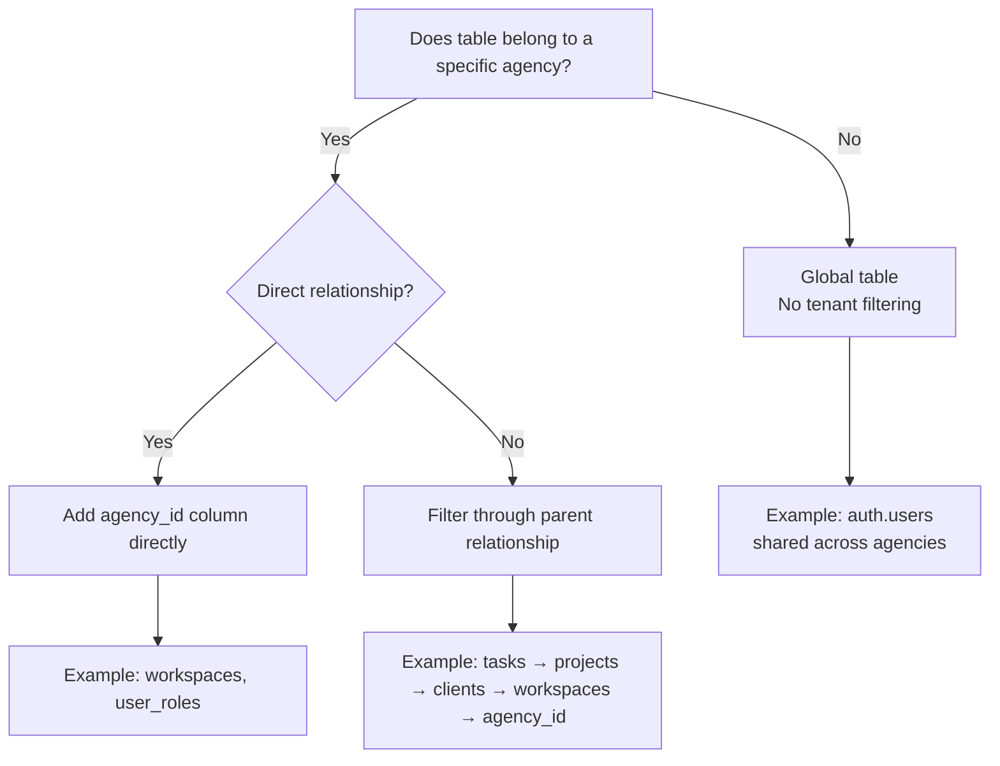
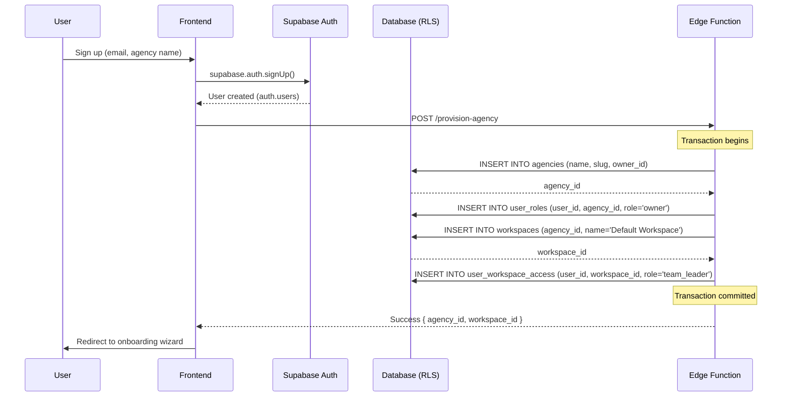

# Multi-Tenancy Design Document — Ninja Gen Z Platform

## TL;DR

This document defines the complete multi-tenancy architecture for the Ninja Gen Z platform. The system implements **database-level tenant isolation** using **Row Level Security (RLS)** in PostgreSQL, where each agency is a completely isolated tenant. All database tables include `agency_id` (root level) or cascade through `workspace_id` → `client_id` → `project_id` for hierarchical filtering. Cross-tenant data leakage is prevented through RLS policies that automatically check JWT claims (`auth.uid()` and `app_metadata.agency_id`) on every query. This design supports **unlimited agencies** on a shared database while ensuring complete data isolation, GDPR compliance, and optimal query performance through strategic indexing.

---

## Table of Contents

- [1. Multi-Tenancy Overview](#1-multi-tenancy-overview)
- [2. Tenant Isolation Strategy](#2-tenant-isolation-strategy)
- [3. RLS Policy Patterns](#3-rls-policy-patterns)
- [4. Tenant Provisioning Workflow](#4-tenant-provisioning-workflow)
- [5. Cross-Tenant Security](#5-cross-tenant-security)
- [6. Performance Optimization](#6-performance-optimization)
- [7. Tenant Deletion & Offboarding](#7-tenant-deletion--offboarding)
- [8. Testing Multi-Tenancy](#8-testing-multi-tenancy)
- [9. Next Steps](#9-next-steps)
- [10. References](#10-references)
- [11. Changelog](#11-changelog)

---

## 1. Multi-Tenancy Overview

### 1.1 What is Multi-Tenancy?

**Definition:** A single application instance serves multiple customers (tenants), with complete data isolation between tenants.

**In Ninja Gen Z Platform:**

- **Tenant = Agency** (e.g., "Acme Marketing", "Ninja Gen Z Agency")
- Each agency has its own:
  - Workspaces, Clients, Projects, Tasks
  - Team members with specific roles
  - Brand kits, files, comments
  - Integrations (Meta Ads, Google Ads)
  - Activity logs

### 1.2 Multi-Tenancy Models Comparison

| Model | Description | Pros | Cons | Our Choice |
|:------|:------------|:-----|:-----|:-----------|
| **Database per Tenant** | Each agency gets a separate database | Maximum isolation | High operational overhead | ❌ Not selected |
| **Schema per Tenant** | Each agency gets a separate schema in one database | Good isolation, moderate overhead | Complex migrations | ❌ Not selected |
| **Shared Database + RLS** | All tenants share tables, RLS enforces isolation | Low overhead, easy scaling | Requires careful RLS implementation | ✅ **Selected** |

**Why Shared Database + RLS?**

| Criterion | Justification |
|:----------|:--------------|
| **Scalability** | Supports thousands of agencies without infrastructure changes |
| **Cost** | Single database reduces hosting costs (Supabase pricing based on database size) |
| **Maintainability** | One migration applies to all tenants |
| **Performance** | PostgreSQL handles RLS efficiently with proper indexing |
| **GDPR Compliance** | RLS guarantees tenant isolation at database level |

### 1.3 Tenant Hierarchy

```
Agency (Tenant Root)
│
├── Agency Settings (name, logo, timezone, language, currency)
├── User Roles (owner, team_leader, member, client)
│
└── Workspaces (e.g., "Social Media Team", "Ads Team")
    │
    ├── Workspace Members (team_leader, member)
    │
    └── Clients (e.g., "Nike Egypt", "Adidas Egypt")
        │
        ├── Brand Kit (colors, fonts, logos)
        │
        └── Projects (e.g., "Ramadan Campaign 2026")
            │
            ├── Project Team Members
            │
            └── Tasks (assigned to team members)
                │
                ├── Comments
                ├── Files
                └── Activity Logs
```

---

## 2. Tenant Isolation Strategy

### 2.1 Core Principle

> [!IMPORTANT]
> **Every table must be filterable by `agency_id` (direct or through joins).**

### 2.2 Tenant Filtering Approaches

#### Approach 1: Direct `agency_id` (Root Tables)

**Tables:** `agencies`, `user_roles`, `workspaces`

```sql
-- Example: workspaces table
CREATE TABLE workspaces (
  id UUID PRIMARY KEY DEFAULT uuid_generate_v4(),
  agency_id UUID REFERENCES agencies(id) ON DELETE CASCADE NOT NULL,
  name TEXT NOT NULL,
  ...
);

-- RLS Policy
CREATE POLICY "users_view_own_agency_workspaces"
ON workspaces FOR SELECT
USING (
  agency_id IN (
    SELECT agency_id FROM user_roles WHERE user_id = auth.uid()
  )
);
```

#### Approach 2: Cascade Through Hierarchy

**Tables:** `clients`, `projects`, `tasks`, `comments`, `files`

```sql
-- Example: tasks table (no direct agency_id)
CREATE TABLE tasks (
  id UUID PRIMARY KEY DEFAULT uuid_generate_v4(),
  project_id UUID REFERENCES projects(id) ON DELETE CASCADE NOT NULL,
  title TEXT NOT NULL,
  ...
);

-- RLS Policy (joins to find agency_id)
CREATE POLICY "users_view_agency_tasks"
ON tasks FOR SELECT
USING (
  project_id IN (
    SELECT p.id FROM projects p
    JOIN clients c ON c.id = p.client_id
    JOIN workspaces w ON w.id = c.workspace_id
    WHERE w.agency_id IN (
      SELECT agency_id FROM user_roles WHERE user_id = auth.uid()
    )
  )
);
```

### 2.3 Tenant Filtering Decision Tree



### 2.4 Tables by Tenant Isolation Method

| Table | Isolation Method | Filter Column |
|:------|:-----------------|:--------------|
| `agencies` | Direct | `id` (self) |
| `user_roles` | Direct | `agency_id` |
| `workspaces` | Direct | `agency_id` |
| `user_workspace_access` | Cascade | `workspace_id` → `agency_id` |
| `clients` | Cascade | `workspace_id` → `agency_id` |
| `projects` | Cascade | `client_id` → `workspace_id` → `agency_id` |
| `project_team_members` | Cascade | `project_id` → ... |
| `tasks` | Cascade | `project_id` → ... |
| `comments` | Cascade | `task_id` → `project_id` → ... |
| `files` | Cascade | `task_id` → `project_id` → ... |
| `brand_kits` | Cascade | `client_id` → `workspace_id` → `agency_id` |
| `activity_logs` | Cascade | `entity_id` (depends on `entity_type`) |
| `notifications` | Direct | `user_id` (users belong to agencies via `user_roles`) |
| `user_profiles` | Global | `user_id` (users can belong to multiple agencies) |
| `auth.users` | Global | N/A (Supabase managed, shared) |

---

## 3. RLS Policy Patterns

### 3.1 RLS Policy Template Library

#### Pattern 1: Direct Agency Filter

**Use Case:** Tables with direct `agency_id` column

```sql
-- Template
CREATE POLICY "policy_name"
ON {table_name} FOR {operation}
USING (
  agency_id IN (
    SELECT agency_id FROM user_roles WHERE user_id = auth.uid()
  )
);

-- Example: Workspaces
CREATE POLICY "users_view_own_agency_workspaces"
ON workspaces FOR SELECT
USING (
  agency_id IN (
    SELECT agency_id FROM user_roles WHERE user_id = auth.uid()
  )
);
```

#### Pattern 2: Role-Based Policy

**Use Case:** Restrict actions to specific roles (e.g., only owners can delete agencies)

```sql
-- Template
CREATE POLICY "policy_name"
ON {table_name} FOR {operation}
USING (
  EXISTS (
    SELECT 1 FROM user_roles 
    WHERE user_id = auth.uid() 
    AND agency_id = {table_name}.agency_id
    AND role = '{required_role}'
  )
);

-- Example: Only owners can update agency settings
CREATE POLICY "only_owners_update_agency"
ON agencies FOR UPDATE
USING (
  EXISTS (
    SELECT 1 FROM user_roles
    WHERE user_id = auth.uid()
    AND agency_id = agencies.id
    AND role = 'owner'
  )
);
```

#### Pattern 3: Hierarchical Filter (Join-Based)

**Use Case:** Tables without direct `agency_id` (e.g., tasks)

```sql
-- Template
CREATE POLICY "policy_name"
ON {table_name} FOR SELECT
USING (
  {foreign_key} IN (
    SELECT id FROM {parent_table}
    WHERE agency_id IN (
      SELECT agency_id FROM user_roles WHERE user_id = auth.uid()
    )
  )
);

-- Example: Tasks (via projects → clients → workspaces)
CREATE POLICY "users_view_agency_tasks"
ON tasks FOR SELECT
USING (
  project_id IN (
    SELECT p.id FROM projects p
    JOIN clients c ON c.id = p.client_id
    JOIN workspaces w ON w.id = c.workspace_id
    WHERE w.agency_id IN (
      SELECT agency_id FROM user_roles WHERE user_id = auth.uid()
    )
  )
);
```

#### Pattern 4: Workspace-Scoped Access

**Use Case:** Users need workspace-level access (not agency-wide)

```sql
-- Example: Users can only see tasks in workspaces they have access to
CREATE POLICY "users_view_workspace_tasks"
ON tasks FOR SELECT
USING (
  project_id IN (
    SELECT p.id FROM projects p
    JOIN clients c ON c.id = p.client_id
    WHERE c.workspace_id IN (
      SELECT workspace_id FROM user_workspace_access WHERE user_id = auth.uid()
    )
  )
);
```

#### Pattern 5: Assigned User Access

**Use Case:** Users can access resources explicitly assigned to them

```sql
-- Example: Users can view tasks assigned to them
CREATE POLICY "users_view_assigned_tasks"
ON tasks FOR SELECT
USING (assigned_to = auth.uid());

-- Example: Users can update tasks assigned to them
CREATE POLICY "users_update_assigned_tasks"
ON tasks FOR UPDATE
USING (assigned_to = auth.uid())
WITH CHECK (assigned_to = auth.uid());
```

### 3.2 Complex RLS Policy: Activity Logs

**Challenge:** Activity logs can reference any entity type (task, project, client, etc.)

**Solution:** Dynamic join based on `entity_type`

```sql
CREATE POLICY "users_view_agency_activity_logs"
ON activity_logs FOR SELECT
USING (
  CASE entity_type
    WHEN 'task' THEN 
      entity_id IN (
        SELECT t.id FROM tasks t
        JOIN projects p ON p.id = t.project_id
        JOIN clients c ON c.id = p.client_id
        JOIN workspaces w ON w.id = c.workspace_id
        WHERE w.agency_id IN (
          SELECT agency_id FROM user_roles WHERE user_id = auth.uid()
        )
      )
    WHEN 'project' THEN
      entity_id IN (
        SELECT p.id FROM projects p
        JOIN clients c ON c.id = p.client_id
        JOIN workspaces w ON w.id = c.workspace_id
        WHERE w.agency_id IN (
          SELECT agency_id FROM user_roles WHERE user_id = auth.uid()
        )
      )
    WHEN 'client' THEN
      entity_id IN (
        SELECT c.id FROM clients c
        JOIN workspaces w ON w.id = c.workspace_id
        WHERE w.agency_id IN (
          SELECT agency_id FROM user_roles WHERE user_id = auth.uid()
        )
      )
    WHEN 'workspace' THEN
      entity_id IN (
        SELECT id FROM workspaces
        WHERE agency_id IN (
          SELECT agency_id FROM user_roles WHERE user_id = auth.uid()
        )
      )
    ELSE false
  END
);
```

### 3.3 RLS Testing Queries

**Test 1: Verify no cross-tenant leakage**

```sql
-- Setup: Create two agencies and one user per agency
INSERT INTO agencies (id, name, slug) VALUES 
  ('agency-1', 'Agency One', 'agency-one'),
  ('agency-2', 'Agency Two', 'agency-two');

INSERT INTO user_roles (user_id, agency_id, role) VALUES
  ('user-1', 'agency-1', 'owner'),
  ('user-2', 'agency-2', 'owner');

-- Test: User 1 should NOT see Agency 2's workspaces
SET request.jwt.claims.sub = 'user-1';
SELECT * FROM workspaces WHERE agency_id = 'agency-2';
-- Expected: 0 rows (blocked by RLS)

-- Test: User 1 SHOULD see Agency 1's workspaces
SELECT * FROM workspaces WHERE agency_id = 'agency-1';
-- Expected: Rows returned (allowed by RLS)
```

**Test 2: Verify role-based restrictions**

```sql
-- Setup: User 1 is member (not owner) in Agency 1
UPDATE user_roles SET role = 'member' WHERE user_id = 'user-1';

-- Test: Member should NOT be able to update agency settings
SET request.jwt.claims.sub = 'user-1';
UPDATE agencies SET name = 'Hacked' WHERE id = 'agency-1';
-- Expected: 0 rows updated (blocked by RLS)
```

---

## 4. Tenant Provisioning Workflow

### 4.1 New Agency Signup Flow



### 4.2 Provisioning Function

```typescript
// supabase/functions/provision-agency/index.ts
import { createClient } from '@supabase/supabase-js';

export default async (req: Request) => {
  const { email, agencyName } = await req.json();
  
  const supabase = createClient(
    Deno.env.get('SUPABASE_URL')!,
    Deno.env.get('SUPABASE_SERVICE_ROLE_KEY')! // Bypass RLS
  );
  
  try {
    // 1. Create agency
    const { data: agency, error: agencyError } = await supabase
      .from('agencies')
      .insert({
        name: agencyName,
        slug: agencyName.toLowerCase().replace(/\s+/g, '-'),
        owner_id: req.headers.get('x-user-id') // From JWT
      })
      .select()
      .single();
    
    if (agencyError) throw agencyError;
    
    // 2. Assign owner role
    await supabase.from('user_roles').insert({
      user_id: req.headers.get('x-user-id'),
      agency_id: agency.id,
      role: 'owner'
    });
    
    // 3. Create default workspace
    const { data: workspace } = await supabase
      .from('workspaces')
      .insert({
        agency_id: agency.id,
        name: 'وركسبيس افتراضي', // "Default Workspace" in Arabic
        created_by: req.headers.get('x-user-id')
      })
      .select()
      .single();
    
    // 4. Grant workspace access
    await supabase.from('user_workspace_access').insert({
      user_id: req.headers.get('x-user-id'),
      workspace_id: workspace.id,
      role: 'team_leader'
    });
    
    return new Response(JSON.stringify({
      agency_id: agency.id,
      workspace_id: workspace.id
    }), {
      status: 200,
      headers: { 'Content-Type': 'application/json' }
    });
  } catch (error) {
    return new Response(JSON.stringify({ error: error.message }), {
      status: 500
    });
  }
};
```

### 4.3 User Invitation to Existing Agency

```typescript
// supabase/functions/invite-user/index.ts
export default async (req: Request) => {
  const { email, agencyId, role, workspaceIds } = await req.json();
  
  // Verify requester is owner or team leader
  const { data: requester } = await supabase
    .from('user_roles')
    .select('role')
    .eq('user_id', req.headers.get('x-user-id'))
    .eq('agency_id', agencyId)
    .single();
  
  if (!['owner', 'team_leader'].includes(requester.role)) {
    return new Response('Forbidden', { status: 403 });
  }
  
  // Create user if doesn't exist
  const { data: authUser, error } = await supabase.auth.admin.createUser({
    email,
    email_confirm: false // User must verify email
  });
  
  if (error && error.message !== 'User already registered') {
    throw error;
  }
  
  // Assign agency role
  await supabase.from('user_roles').insert({
    user_id: authUser.user.id,
    agency_id: agencyId,
    role
  });
  
  // Grant workspace access
  for (const workspaceId of workspaceIds) {
    await supabase.from('user_workspace_access').insert({
      user_id: authUser.user.id,
      workspace_id: workspaceId,
      role: 'member'
    });
  }
  
  // Send invitation email (Supabase handles this automatically)
  return new Response('Invitation sent', { status: 200 });
};
```

---

## 5. Cross-Tenant Security

### 5.1 Attack Vectors & Mitigations

#### Attack 1: Direct ID Guessing

**Attack:** User tries to access another agency's data by guessing UUIDs

```http
GET /api/workspaces/abc-123-other-agency-workspace-uuid
Authorization: Bearer {user_jwt}
```

**Mitigation:** RLS policy blocks query

```sql
-- RLS automatically filters by agency_id
CREATE POLICY "users_view_own_agency_workspaces"
ON workspaces FOR SELECT
USING (
  agency_id IN (SELECT agency_id FROM user_roles WHERE user_id = auth.uid())
);

-- Result: Returns 0 rows (not 403 error, to prevent UUID enumeration)
```

#### Attack 2: SQL Injection via Client Input

**Attack:** Malicious user tries to inject SQL through search

```typescript
// ❌ UNSAFE (never use raw SQL with user input)
const searchQuery = userInput; // "'; DROP TABLE workspaces; --"
const { data } = await supabase.rpc('raw_search', { query: searchQuery });
```

**Mitigation:** Use parameterized queries (Supabase client sanitizes)

```typescript
// ✅ SAFE: Supabase sanitizes all inputs
const { data } = await supabase
  .from('workspaces')
  .select('*')
  .ilike('name', `%${userInput}%`); // Parameterized, safe
```

#### Attack 3: JWT Manipulation

**Attack:** User modifies JWT to change `agency_id` in claims

```json
{
  "sub": "user-123",
  "app_metadata": {
    "agency_id": "other-agency-uuid" // Modified by attacker
  }
}
```

**Mitigation:** JWTs are cryptographically signed by Supabase

- **Server validates signature** before accepting claims
- Invalid signature → JWT rejected, request fails with 401

#### Attack 4: Cross-Tenant API Calls

**Attack:** User calls API endpoint with another agency's resource ID

```typescript
// Frontend code
await supabase.from('tasks').delete().eq('id', otherAgencyTaskId);
```

**Mitigation:** RLS prevents deletion

```sql
CREATE POLICY "users_delete_agency_tasks"
ON tasks FOR DELETE
USING (
  project_id IN (
    SELECT p.id FROM projects p
    JOIN clients c ON c.id = p.client_id
    JOIN workspaces w ON w.id = c.workspace_id
    WHERE w.agency_id IN (
      SELECT agency_id FROM user_roles WHERE user_id = auth.uid()
    )
  )
);

-- Result: 0 rows deleted (task doesn't match RLS filter)
```

### 5.2 Security Checklist

**Pre-Launch Verification:**

- [ ] All tables have RLS enabled (`ALTER TABLE {table} ENABLE ROW LEVEL SECURITY;`)
- [ ] All tables have at least one SELECT policy
- [ ] All tables have INSERT/UPDATE/DELETE policies (or explicitly deny)
- [ ] No raw SQL queries with user input
- [ ] All foreign keys include `ON DELETE CASCADE` to prevent orphaned records
- [ ] JWT claims include `agency_id` for all authenticated users
- [ ] Test with multiple agencies and verify no cross-tenant data access

**Automated Test:**

```sql
-- Verify all tables have RLS enabled
SELECT tablename 
FROM pg_tables 
WHERE schemaname = 'public'
  AND tablename NOT IN ('auth.users') -- Exclude Supabase managed
  AND tablename NOT IN (
    SELECT tablename 
    FROM pg_tables t
    JOIN pg_policies p ON p.tablename = t.tablename
  );
-- Expected: 0 rows (all tables have RLS policies)
```

---

## 6. Performance Optimization

### 6.1 Index Strategy for Multi-Tenancy

**Critical Indexes:**

```sql
-- All tables with agency_id
CREATE INDEX idx_{table}_agency ON {table}(agency_id);

-- All foreign keys (for join performance)
CREATE INDEX idx_workspaces_agency ON workspaces(agency_id);
CREATE INDEX idx_clients_workspace ON clients(workspace_id);
CREATE INDEX idx_projects_client ON projects(client_id);
CREATE INDEX idx_tasks_project ON tasks(project_id);

-- Composite indexes for common queries
CREATE INDEX idx_tasks_status_deadline ON tasks(status, deadline);
CREATE INDEX idx_activity_logs_entity ON activity_logs(entity_type, entity_id, created_at DESC);
```

### 6.2 Query Optimization

**Anti-Pattern: N+1 Queries**

```typescript
// ❌ BAD: Fetches tasks, then assignees one-by-one
const tasks = await supabase.from('tasks').select('*');
for (const task of tasks) {
  const { data: assignee } = await supabase
    .from('auth.users')
    .select('*')
    .eq('id', task.assigned_to);
}
```

**Optimized: Single Query with Joins**

```typescript
// ✅ GOOD: Fetch all data in one query
const { data: tasks } = await supabase
  .from('tasks')
  .select(`
    *,
    assignee:auth.users!assigned_to(id, full_name, avatar_url),
    project:projects(
      id, 
      name,
      client:clients(id, name)
    )
  `);
```

### 6.3 Connection Pooling

**Supabase PgBouncer Configuration:**

- **Pool Mode:** Transaction (best for serverless)
- **Max Connections:** 200 (Pro plan)
- **Default Pool Size:** 15

**Best Practices:**

- Reuse Supabase client instance (don't create new client per request)
- Close connections in long-running Edge Functions

---

## 7. Tenant Deletion & Offboarding

### 7.1 Soft Delete vs Hard Delete

**Soft Delete (Recommended for Phase 1):**

```sql
-- Add deleted_at column to agencies
ALTER TABLE agencies ADD COLUMN deleted_at TIMESTAMP;

-- Mark as deleted (retain data for recovery)
UPDATE agencies SET deleted_at = NOW() WHERE id = 'agency-uuid';

-- Hide deleted agencies in queries
CREATE POLICY "users_view_active_agencies"
ON agencies FOR SELECT
USING (
  deleted_at IS NULL
  AND (
    id IN (SELECT agency_id FROM user_roles WHERE user_id = auth.uid())
  )
);
```

**Hard Delete (Phase 2+):**

```typescript
// Delete agency and all related data (cascades automatically)
await supabase.from('agencies').delete().eq('id', agencyId);

// Cascade deletes:
// - workspaces (via FK)
// - clients (via FK cascade)
// - projects (via FK cascade)
// - tasks (via FK cascade)
// - comments, files, activity_logs (all cascade)
```

### 7.2 Data Export Before Deletion

**GDPR Requirement:** Users must be able to export data before deletion

```typescript
// Export all agency data
export default async (req: Request) => {
  const agencyId = req.headers.get('x-agency-id');
  
  const [workspaces, clients, projects, tasks] = await Promise.all([
    supabase.from('workspaces').select('*').eq('agency_id', agencyId),
    supabase.from('clients').select('*').eq('workspace_id', /* ... */),
    // ... fetch all related data
  ]);
  
  const exportData = {
    agency_id: agencyId,
    exported_at: new Date().toISOString(),
    workspaces: workspaces.data,
    clients: clients.data,
    projects: projects.data,
    tasks: tasks.data
  };
  
  return new Response(JSON.stringify(exportData, null, 2), {
    headers: {
      'Content-Type': 'application/json',
      'Content-Disposition': `attachment; filename="agency-export-${agencyId}.json"`
    }
  });
};
```

---

## 8. Testing Multi-Tenancy

### 8.1 Test Scenarios

**Scenario 1: Cross-Tenant Data Access**

```typescript
// Test: User from Agency A cannot see Agency B's data
describe('Cross-Tenant Isolation', () => {
  it('should block access to other agency workspaces', async () => {
    // Setup: Create two agencies
    const agencyA = await createAgency('Agency A');
    const agencyB = await createAgency('Agency B');
    
    // Login as user from Agency A
    await supabase.auth.signInWithPassword({
      email: 'user-a@example.com',
      password: 'password'
    });
    
    // Try to access Agency B's workspace
    const { data, error } = await supabase
      .from('workspaces')
      .select('*')
      .eq('agency_id', agencyB.id);
    
    // Assert: No data returned (RLS blocked)
    expect(data).toHaveLength(0);
    expect(error).toBeNull(); // No error, just empty result
  });
});
```

**Scenario 2: Role-Based Permissions**

```typescript
it('should prevent members from deleting projects', async () => {
  const agency = await createAgency('Test Agency');
  const member = await createUser(agency.id, 'member');
  
  await supabase.auth.signInAs(member.id);
  
  const { error } = await supabase
    .from('projects')
    .delete()
    .eq('id', testProjectId);
  
  expect(error).toBeTruthy(); // Deletion blocked by RLS
});
```

### 8.2 Load Testing Multi-Tenancy

**Test 100 concurrent agencies:**

```bash
# Use k6 for load testing
k6 run --vus 100 --duration 30s load-test.js
```

```javascript
// load-test.js
import http from 'k6/http';

export default function () {
  const agencyId = `agency-${__VU}`; // Unique per virtual user
  const token = getAuthToken(agencyId);
  
  const res = http.get(`https://api.ninjagenzy.com/workspaces`, {
    headers: { 'Authorization': `Bearer ${token}` }
  });
  
  check(res, {
    'status is 200': (r) => r.status === 200,
    'no cross-tenant data': (r) => {
      const data = JSON.parse(r.body);
      return data.every(w => w.agency_id === agencyId);
    }
  });
}
```

---

## 9. Next Steps

- [ ] Enable RLS on all tables in Supabase Dashboard
- [ ] Write RLS policies for each table using template patterns
- [ ] Test RLS policies with multiple test agencies
- [ ] Create agency provisioning Edge Function
- [ ] Implement user invitation flow
- [ ] Add `agency_id` to JWT claims via Database Function
- [ ] Create indexes on all `agency_id` and foreign key columns
- [ ] Write automated tests for cross-tenant isolation
- [ ] Document tenant offboarding process
- [ ] Set up monitoring for RLS policy violations (log failed queries)

---

## 10. References

- [Supabase Row Level Security Documentation](https://supabase.com/docs/guides/auth/row-level-security)
- [PostgreSQL RLS Best Practices](https://www.postgresql.org/docs/current/ddl-rowsecurity.html)
- [Database Design Document](file:///e:/docs/docs/Technical%20Documentation/Database-Design-Document.md)
- [Security & Compliance Document](file:///e:/docs/docs/Technical%20Documentation/Security-Compliance-Document.md)
- [System Architecture Document](file:///e:/docs/docs/System%20Architecture/System%20Architecture.md)

---

## 11. Changelog

- **v1.0** (2026-01-24): Initial multi-tenancy design document
  - Multi-tenancy model comparison and selection (Shared DB + RLS)
  - Tenant isolation strategies (direct vs. cascade)
  - RLS policy pattern library (5 common patterns)
  - Tenant provisioning workflow and code examples
  - Cross-tenant security analysis and mitigations
  - Performance optimization strategies
  - Tenant deletion procedures (soft vs. hard delete)
  - Multi-tenancy testing scenarios
