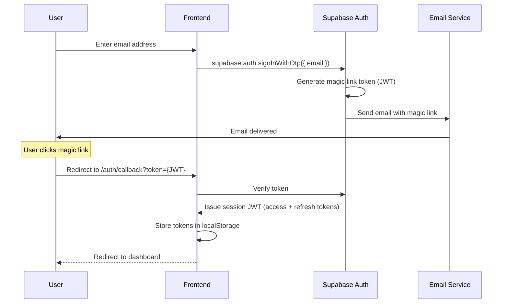
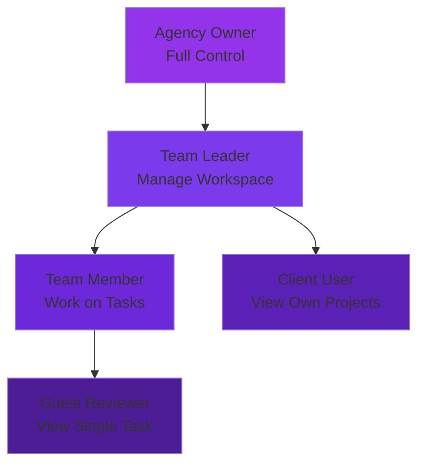
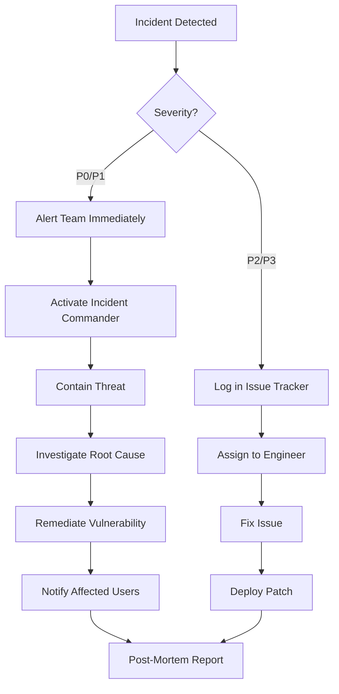

# Security & Compliance Document — Ninja Gen Z Platform

## TL;DR

This document defines the comprehensive security architecture and compliance framework for the Ninja Gen Z platform. It covers **authentication** (Supabase Auth with magic links + 2FA), **authorization** (RBAC with 5 roles and Row Level Security), **data encryption** (at-rest via pgcrypto, in-transit via TLS 1.3), **API security** (rate limiting, CORS, JWT validation), **GDPR compliance** (data portability, right to deletion, consent management), and **incident response** procedures. All security measures align with OWASP Top 10 best practices and are designed to protect multi-tenant data in a MENA-focused SaaS application.

---

## Table of Contents

- [1. Authentication](#1-authentication)
- [2. Authorization (RBAC)](#2-authorization-rbac)
- [3. Data Encryption](#3-data-encryption)
- [4. API Security](#4-api-security)
- [5. GDPR & Privacy Compliance](#5-gdpr--privacy-compliance)
- [6. Audit Logging](#6-audit-logging)
- [7. Incident Response Plan](#7-incident-response-plan)
- [8. Penetration Testing](#8-penetration-testing)
- [9. Next Steps](#9-next-steps)
- [10. References](#10-references)
- [11. Changelog](#11-changelog)

---

## 1. Authentication

### 1.1 Authentication Strategy

**Provider:** Supabase Auth (built on GoTrue)

**Methods Supported:**

| Method | Phase | Priority | Use Case |
|:-------|:------|:---------|:---------|
| **Magic Link** (Email) | Phase 1 | Primary | Agency teams, passwordless login |
| **Email + Password** | Phase 1 | Secondary | Users who prefer traditional login |
| **Two-Factor Authentication (2FA)** | Phase 5 | High Security | Owners, financial data access |
| **Google OAuth** | Phase 2 | Convenience | Quick signup for new agencies |
| **SSO (SAML)** | Phase 5 | Enterprise | Large agencies with corporate IT |

### 1.2 Magic Link Flow (Primary Method)

#### Why Magic Links?

- **Better UX:** No password to remember or reset
- **More Secure:** No password reuse, phishing-resistant
- **MENA-Friendly:** Arabic emails work seamlessly

#### Sequence Diagram



#### Code Example

```typescript
// src/lib/auth/magic-link.ts
import { supabase } from '@/lib/supabase/client';

export async function sendMagicLink(email: string) {
  const { data, error } = await supabase.auth.signInWithOtp({
    email,
    options: {
      emailRedirectTo: 'https://app.ninjagenzy.com/auth/callback',
      shouldCreateUser: false // Only allow existing users (Phase 1)
    }
  });

  if (error) {
    if (error.message.includes('Email not confirmed')) {
      throw new Error('البريد الإلكتروني غير مفعّل'); // Arabic error
    }
    throw error;
  }

  return data;
}
```

### 1.3 Session Management

**Token Types:**

- **Access Token (JWT):** Short-lived (1 hour), used for API authentication
- **Refresh Token:** Long-lived (30 days), used to obtain new access tokens

**Storage:**

```typescript
// Access token stored in memory + refresh token in localStorage
// (Future: Move refresh token to httpOnly cookie for better security)

const session = await supabase.auth.getSession();
// session.access_token: Use for API calls
// session.refresh_token: Auto-refreshed by Supabase client
```

**Auto-Refresh:**

Supabase client automatically refreshes access token 60 seconds before expiration using refresh token.

### 1.4 JWT Claims

**Standard Claims:**

```json
{
  "sub": "user-uuid-123",
  "email": "user@example.com",
  "email_confirmed_at": "2026-01-24T10:30:00Z",
  "aud": "authenticated",
  "role": "authenticated",
  "exp": 1706097000,
  "iat": 1706093400
}
```

**Custom Claims (Added via Database Function):**

```json
{
  "app_metadata": {
    "agency_id": "agency-uuid-456",
    "user_role": "team_leader",
    "workspace_id": "workspace-uuid-789"
  }
}
```

**Usage in RLS Policies:**

```sql
-- RLS policy uses JWT claims
CREATE POLICY "Users see their agency data"
ON workspaces FOR SELECT
USING (
  agency_id = (auth.jwt() -> 'app_metadata' ->> 'agency_id')::uuid
);
```

### 1.5 Password Policy (If Using Email+Password)

> [!IMPORTANT]
> **Minimum Requirements** (enforced by Supabase):
> - Minimum length: 8 characters
> - Must contain: 1 uppercase, 1 lowercase, 1 number
> - No common passwords (via `have-i-been-pwned` check)

```typescript
// Supabase auto-validates on signup
const { data, error } = await supabase.auth.signUp({
  email: 'user@example.com',
  password: 'SecurePass123',
  options: {
    data: {
      full_name: 'Ahmed Hassan' // Stored in auth.users.raw_user_meta_data
    }
  }
});
```

### 1.6 Two-Factor Authentication (2FA) - Phase 5

**Methods:**

- **TOTP (Authenticator Apps):** Google Authenticator, Authy
- **SMS:** Via Twilio (fallback, less secure)

**Enrollment Flow:**

```typescript
// Enable 2FA for user
const { data, error } = await supabase.auth.mfa.enroll({
  factorType: 'totp'
});

// data.totp contains:
// - secret: Shared secret for authenticator app
// - qr_code: Base64 QR code image
// - uri: otpauth://totp/... URI for manual entry

// User scans QR code → enters 6-digit code to verify
await supabase.auth.mfa.challenge({ factorId: data.id });
await supabase.auth.mfa.verify({ factorId: data.id, code: '123456' });
```

---

## 2. Authorization (RBAC)

### 2.1 Role Hierarchy

**5 Roles (Agency-Level):**



### 2.2 RBAC Matrix

**Complete Permission Matrix:**

| Resource | Owner | Team Leader | Member | Client | Guest |
|:---------|:------|:------------|:-------|:-------|:------|
| **Agency Settings** | ✅ CRUD | ❌ None | ❌ None | ❌ None | ❌ None |
| **Billing** | ✅ Full | ❌ None | ❌ None | ❌ None | ❌ None |
| **Workspace** | ✅ CRUD | ✅ CRUD (own) | ✅ Read | ❌ None | ❌ None |
| **Client** | ✅ CRUD | ✅ CRUD | ✅ Read | ✅ Read (own only) | ❌ None |
| **Project** | ✅ CRUD | ✅ CRUD | ✅ CRUD (assigned) | ✅ Read (own) | ❌ None |
| **Task** | ✅ CRUD | ✅ CRUD | ✅ CRUD (assigned) | ✅ Read + Comment | ✅ Read (specific) |
| **Brand Kit** | ✅ CRUD | ✅ CRUD | ✅ Read | ✅ Read (own) | ❌ None |
| **Time Tracking** | ✅ View All | ✅ View Team | ✅ Own Only | ❌ None | ❌ None |
| **Reports** | ✅ All | ✅ Workspace | ✅ Own | ❌ None | ❌ None |
| **Integrations** | ✅ CRUD | ✅ Read | ❌ None | ❌ None | ❌ None |
| **User Management** | ✅ Add/Remove | ✅ Invite (workspace) | ❌ None | ❌ None | ❌ None |

### 2.3 RLS Policy Implementation

**Reference:** [Database Design Document](file:///e:/docs/docs/Technical%20Documentation/Database-Design-Document.md#5-row-level-security-rls-policies)

#### Example: Tasks RLS Policy

```sql
-- Enable RLS
ALTER TABLE tasks ENABLE ROW LEVEL SECURITY;

-- Policy 1: Users can see tasks in their workspace
CREATE POLICY "users_view_workspace_tasks"
ON tasks FOR SELECT
USING (
  project_id IN (
    SELECT p.id 
    FROM projects p
    JOIN clients c ON c.id = p.client_id
    JOIN workspaces w ON w.id = c.workspace_id
    JOIN user_workspace_access uwa ON uwa.workspace_id = w.id
    WHERE uwa.user_id = auth.uid()
  )
);

-- Policy 2: Only assigned users can update task status
CREATE POLICY "assigned_users_update_tasks"
ON tasks FOR UPDATE
USING (assigned_to = auth.uid())
WITH CHECK (assigned_to = auth.uid());

-- Policy 3: Team Leaders can update any task in their workspace
CREATE POLICY "team_leaders_update_workspace_tasks"
ON tasks FOR UPDATE
USING (
  EXISTS (
    SELECT 1 
    FROM user_workspace_access uwa
    JOIN workspaces w ON w.id = uwa.workspace_id
    JOIN clients c ON c.workspace_id = w.id
    JOIN projects p ON p.client_id = c.id
    WHERE p.id = tasks.project_id
      AND uwa.user_id = auth.uid()
      AND uwa.role = 'team_leader'
  )
);

-- Policy 4: Owners can do anything
CREATE POLICY "owners_full_access"
ON tasks FOR ALL
USING (
  EXISTS (
    SELECT 1 
    FROM user_roles ur
    JOIN agencies a ON a.id = ur.agency_id
    JOIN workspaces w ON w.agency_id = a.id
    JOIN clients c ON c.workspace_id = w.id
    JOIN projects p ON p.client_id = c.id
    WHERE p.id = tasks.project_id
      AND ur.user_id = auth.uid()
      AND ur.role = 'owner'
  )
);
```

### 2.4 Frontend Permission Checks

```typescript
// src/lib/rbac/permissions.ts
import { useUser } from '@/hooks/useUser';

export function usePermissions() {
  const { user, role } = useUser();

  return {
    canCreateWorkspace: role === 'owner' || role === 'team_leader',
    canDeleteProject: role === 'owner',
    canEditTask: (task: Task) => {
      return role === 'owner' || 
             role === 'team_leader' || 
             task.assigned_to === user.id;
    },
    canViewBilling: role === 'owner',
    canManageIntegrations: role === 'owner' || role === 'team_leader'
  };
}

// Usage in component
function TaskCard({ task }) {
  const { canEditTask } = usePermissions();
  
  return (
    <div>
      {canEditTask(task) && (
        <button onClick={handleEdit}>Edit Task</button>
      )}
    </div>
  );
}
```

---

## 3. Data Encryption

### 3.1 Encryption At Rest

**Database:** PostgreSQL with pgcrypto extension

**Encrypted Columns:**

- `integrations.credentials` (API tokens)
- `meta_ad_accounts.access_token`
- `google_ad_accounts.access_token`
- `google_ad_accounts.refresh_token`

#### Encryption Implementation

```sql
-- Enable pgcrypto extension
CREATE EXTENSION IF NOT EXISTS pgcrypto;

-- Encrypt data before insert
INSERT INTO integrations (agency_id, integration_type, credentials)
VALUES (
  'agency-uuid',
  'meta_ads',
  pgp_sym_encrypt(
    '{"access_token": "secret123", "refresh_token": "secret456"}',
    current_setting('app.settings.encryption_key')
  )::text
);

-- Decrypt when reading (server-side only)
SELECT 
  id,
  agency_id,
  pgp_sym_decrypt(credentials::bytea, current_setting('app.settings.encryption_key'))::text as credentials
FROM integrations
WHERE agency_id = 'agency-uuid';
```

**Encryption Key Management:**

- **Storage:** Supabase Vault (isolated from database)
- **Rotation:** Every 90 days (manual process in Phase 1, automated in Phase 5)
- **Access:** Only backend Edge Functions via Server-side environment variables

### 3.2 Encryption In Transit

**TLS 1.3:** All connections use TLS 1.3 (latest standard)

**Endpoints:**

- **Frontend ↔ Backend:** Vercel (auto-provisions TLS via Let's Encrypt)
- **Backend ↔ Supabase:** TLS enforced by default
- **Backend ↔ External APIs:** HTTPS only (Meta, Google, Cloudinary)

**HSTS Header:**

```typescript
// vercel.json configuration
{
  "headers": [
    {
      "source": "/(.*)",
      "headers": [
        {
          "key": "Strict-Transport-Security",
          "value": "max-age=63072000; includeSubDomains; preload"
        }
      ]
    }
  ]
}
```

### 3.3 Secrets Management

**Development:**

```bash
# .env.local (never commit)
VITE_SUPABASE_URL=https://xxxx.supabase.co
VITE_SUPABASE_ANON_KEY=eyJhbGc...
SUPABASE_SERVICE_ROLE_KEY=eyJhbGc... # Server-side only
ENCRYPTION_KEY=random-32-byte-key
```

**Production:**

- **Frontend Secrets:** Vercel Environment Variables (exposed to client via `VITE_` prefix)
- **Backend Secrets:** Supabase Edge Function secrets (never exposed to client)

```bash
# Set Edge Function secret
supabase secrets set ENCRYPTION_KEY=random-32-byte-key
supabase secrets set META_APP_SECRET=abc123
supabase secrets set GOOGLE_CLIENT_SECRET=xyz789
```

---

## 4. API Security

### 4.1 Rate Limiting

**Supabase Built-in Rate Limits:**

- **Anonymous requests:** 200 requests/hour per IP
- **Authenticated requests:** 1,000 requests/hour per user
- **Edge Functions:** 500 invocations/minute

**Custom Rate Limiting (Phase 2):**

```typescript
// supabase/functions/_shared/rate-limit.ts
import { createClient } from '@supabase/supabase-js';

const rateLimitCache = new Map();

export async function checkRateLimit(userId: string, limit: number, windowMs: number) {
  const key = `rate-limit:${userId}`;
  const now = Date.now();
  
  const userRequests = rateLimitCache.get(key) || [];
  const recentRequests = userRequests.filter(time => now - time < windowMs);
  
  if (recentRequests.length >= limit) {
    throw new Error('Rate limit exceeded');
  }
  
  recentRequests.push(now);
  rateLimitCache.set(key, recentRequests);
  
  return true;
}

// Usage in Edge Function
export default async (req: Request) => {
  const userId = req.headers.get('x-user-id');
  await checkRateLimit(userId, 100, 60000); // 100 requests per minute
  
  // Process request...
};
```

### 4.2 CORS Configuration

**Allowed Origins:**

```typescript
// Supabase Dashboard → Settings → API
const allowedOrigins = [
  'https://app.ninjagenzy.com',
  'https://ninjagenzy.com',
  'http://localhost:5173' // Development only
];
```

**CORS Headers:**

```typescript
// Edge Function response
return new Response(JSON.stringify(data), {
  status: 200,
  headers: {
    'Content-Type': 'application/json',
    'Access-Control-Allow-Origin': 'https://app.ninjagenzy.com',
    'Access-Control-Allow-Methods': 'GET, POST, PUT, DELETE',
    'Access-Control-Allow-Headers': 'Authorization, Content-Type'
  }
});
```

### 4.3 Input Validation

**Zod Schema Validation:**

```typescript
// src/lib/validation/task.ts
import { z } from 'zod';

export const createTaskSchema = z.object({
  title: z.string().min(3).max(200),
  description: z.string().max(5000).optional(),
  project_id: z.string().uuid(),
  assigned_to: z.string().uuid().optional(),
  status: z.enum(['todo', 'in_progress', 'review', 'done']).default('todo'),
  priority: z.enum(['high', 'medium', 'low']).default('medium'),
  deadline: z.string().datetime().optional(),
  estimated_hours: z.number().min(0.1).max(1000).optional()
});

// Usage in API route
async function createTask(req: Request) {
  const body = await req.json();
  
  // Validate input
  const validated = createTaskSchema.parse(body);
  
  // Proceed with database insert...
}
```

### 4.4 SQL Injection Prevention

**Parameterized Queries (Supabase Client):**

```typescript
// ✅ SAFE: Parameterized query
const { data } = await supabase
  .from('tasks')
  .select('*')
  .eq('project_id', userInput); // Safe: Supabase sanitizes

// ❌ UNSAFE: Raw SQL (never use with user input)
const { data } = await supabase.rpc('raw_query', {
  query: `SELECT * FROM tasks WHERE project_id = '${userInput}'` // VULNERABLE!
});
```

### 4.5 XSS Prevention

**React Auto-Escaping:**

React automatically escapes all text content, preventing XSS attacks.

```typescript
// ✅ SAFE: React escapes by default
<div>{task.description}</div>

// ❌ UNSAFE: Bypassing React's escaping
<div dangerouslySetInnerHTML={{ __html: task.description }} />
```

**Content Security Policy (CSP):**

```typescript
// vercel.json
{
  "headers": [
    {
      "source": "/(.*)",
      "headers": [
        {
          "key": "Content-Security-Policy",
          "value": "default-src 'self'; script-src 'self' 'unsafe-inline' 'unsafe-eval' https://cdn.supabase.co; style-src 'self' 'unsafe-inline'; img-src 'self' data: https:; connect-src 'self' https://*.supabase.co wss://*.supabase.co"
        }
      ]
    }
  ]
}
```

---

## 5. GDPR & Privacy Compliance

### 5.1 GDPR Principles

**Lawful Basis:** User consent + legitimate business interest

**Key Requirements:**

1. **Data Minimization:** Only collect necessary data
2. **Purpose Limitation:** Use data only for stated purposes
3. **Storage Limitation:** Delete data when no longer needed
4. **Data Portability:** Users can export their data
5. **Right to Deletion:** Users can delete their account and all data

### 5.2 Consent Management

**Consent Collection (Signup):**

```typescript
// Signup form includes consent checkboxes
const signupSchema = z.object({
  email: z.string().email(),
  full_name: z.string(),
  terms_accepted: z.literal(true, {
    errorMap: () => ({ message: 'يجب الموافقة على الشروط والأحكام' })
  }),
  privacy_accepted: z.literal(true),
  marketing_emails: z.boolean().default(false) // Optional
});
```

**Consent Storage:**

```sql
-- User consent tracking
CREATE TABLE user_consents (
  user_id UUID PRIMARY KEY REFERENCES auth.users(id) ON DELETE CASCADE,
  terms_accepted_at TIMESTAMP NOT NULL,
  privacy_accepted_at TIMESTAMP NOT NULL,
  marketing_emails BOOLEAN DEFAULT false,
  marketing_emails_updated_at TIMESTAMP,
  created_at TIMESTAMP DEFAULT NOW(),
  updated_at TIMESTAMP DEFAULT NOW()
);
```

### 5.3 Data Portability

**Export User Data (GDPR Article 20):**

```typescript
// supabase/functions/export-user-data/index.ts
export default async (req: Request) => {
  const userId = getUserIdFromJWT(req);
  
  // Fetch all user data
  const [profile, tasks, comments, files, activityLogs] = await Promise.all([
    supabase.from('user_profiles').select('*').eq('user_id', userId).single(),
    supabase.from('tasks').select('*').eq('assigned_to', userId),
    supabase.from('comments').select('*').eq('user_id', userId),
    supabase.from('files').select('*').eq('uploaded_by', userId),
    supabase.from('activity_logs').select('*').eq('user_id', userId)
  ]);
  
  const exportData = {
    exported_at: new Date().toISOString(),
    user_profile: profile.data,
    tasks: tasks.data,
    comments: comments.data,
    files: files.data,
    activity_logs: activityLogs.data
  };
  
  return new Response(JSON.stringify(exportData, null, 2), {
    status: 200,
    headers: {
      'Content-Type': 'application/json',
      'Content-Disposition': `attachment; filename="user-data-${userId}.json"`
    }
  });
};
```

### 5.4 Right to Deletion (GDPR Article 17)

**Delete Account Flow:**

```typescript
// supabase/functions/delete-user-account/index.ts
export default async (req: Request) => {
  const userId = getUserIdFromJWT(req);
  
  // 1. Delete user-created content
  await supabase.from('comments').delete().eq('user_id', userId);
  await supabase.from('activity_logs').update({ user_id: null }).eq('user_id', userId); // Anonymize logs
  
  // 2. Reassign tasks to team leader
  const { data: tasks } = await supabase.from('tasks').select('id').eq('assigned_to', userId);
  for (const task of tasks) {
    await supabase.from('tasks').update({ assigned_to: null }).eq('id', task.id);
  }
  
  // 3. Delete auth user (cascade deletes user_profiles, user_roles, etc.)
  await supabase.auth.admin.deleteUser(userId);
  
  return new Response('Account deleted', { status: 200 });
};
```

### 5.5 Data Retention Policy

| Data Type | Retention Period | Reason |
|:----------|:-----------------|:-------|
| **User Profiles** | Until account deletion | Active use |
| **Tasks & Projects** | Until agency deletion | Business records |
| **Activity Logs** | 2 years | Audit trail, compliance |
| **Notifications** | 30 days | Reduce clutter |
| **Files** | Until task deletion | Project deliverables |
| **Integration Tokens** | Until disconnected | Active use |

**Auto-Deletion Cron Job:**

```sql
-- Delete old notifications daily
SELECT cron.schedule(
  'delete-old-notifications',
  '0 2 * * *', -- 2:00 AM daily
  $$
  DELETE FROM notifications 
  WHERE created_at < NOW() - INTERVAL '30 days';
  $$
);

-- Anonymize old activity logs (>2 years)
SELECT cron.schedule(
  'anonymize-old-logs',
  '0 3 1 * *', -- 3:00 AM on 1st of month
  $$
  UPDATE activity_logs 
  SET user_id = NULL, ip_address = NULL, user_agent = NULL
  WHERE created_at < NOW() - INTERVAL '2 years';
  $$
);
```

### 5.6 Privacy Policy & Terms of Service

**Required Pages:**

- `/legal/privacy-policy` (Arabic + English)
- `/legal/terms-of-service` (Arabic + English)
- `/legal/cookie-policy` (if using analytics cookies)

**Key Sections:**

1. Data we collect (email, name, IP, usage data)
2. How we use data (service delivery, analytics)
3. Third-party services (Supabase, Vercel, Meta API)
4. User rights (export, delete, opt-out)
5. Contact: privacy@ninjagenzy.com

---

## 6. Audit Logging

### 6.1 Logged Events

**Reference:** [Database Design Document — Activity Logs](file:///e:/docs/docs/Technical%20Documentation/Database-Design-Document.md#activity_logs)

**Logged Actions:**

- Task created/updated/deleted
- Project created/updated/archived
- Client created/updated/archived
- User added/removed from workspace
- Integration connected/disconnected
- File uploaded/deleted
- Comment added/edited/deleted

**Stored Data:**

- Entity type and ID
- User ID (who performed action)
- Action type (created, updated, deleted, etc.)
- Old and new values (for updates)
- IP address and user agent (for security auditing)
- Timestamp

### 6.2 Automatic Triggers

```sql
-- Trigger for task changes
CREATE OR REPLACE FUNCTION log_task_changes()
RETURNS TRIGGER AS $$
BEGIN
  IF TG_OP = 'INSERT' THEN
    INSERT INTO activity_logs (entity_type, entity_id, user_id, action)
    VALUES ('task', NEW.id, auth.uid(), 'created');
  ELSIF TG_OP = 'UPDATE' THEN
    IF OLD.status != NEW.status THEN
      INSERT INTO activity_logs (
        entity_type, entity_id, user_id, action, field_name, old_value, new_value
      ) VALUES (
        'task', NEW.id, auth.uid(), 'status_changed', 'status',
        to_jsonb(OLD.status), to_jsonb(NEW.status)
      );
    END IF;
    -- Log other field changes...
  ELSIF TG_OP = 'DELETE' THEN
    INSERT INTO activity_logs (entity_type, entity_id, user_id, action)
    VALUES ('task', OLD.id, auth.uid(), 'deleted');
  END IF;
  RETURN NEW;
END;
$$ LANGUAGE plpgsql SECURITY DEFINER;

CREATE TRIGGER task_changes_trigger
  AFTER INSERT OR UPDATE OR DELETE ON tasks
  FOR EACH ROW EXECUTE FUNCTION log_task_changes();
```

### 6.3 Audit Log Retention

**Retention:** 2 years (compliance requirement)  
**After 2 years:** Anonymize (remove `user_id`, `ip_address`, `user_agent`)

---

## 7. Incident Response Plan

### 7.1 Security Incident Categories

| Severity | Examples | Response Time |
|:---------|:---------|:--------------|
| **P0 - Critical** | Data breach, unauthorized access to customer data | < 1 hour |
| **P1 - High** | Service outage, API compromise | < 4 hours |
| **P2 - Medium** | Brute force attempt, suspicious activity | < 24 hours |
| **P3 - Low** | Failed login attempts, minor bug | < 1 week |

### 7.2 Incident Response Workflow



### 7.3 Contact Points

**Incident Response Team:**

- **Incident Commander:** CTO or Security Lead
- **Technical Lead:** Backend Engineer
- **Communications:** Customer Support Manager
- **Legal:** Data Protection Officer (DPO)

**Notification Channels:**

- **Internal:** Slack #incidents channel
- **External:** Email to affected users (GDPR requires notification within 72 hours of data breach)

### 7.4 Post-Mortem Template

```markdown
# Incident Post-Mortem — [Incident Title]

**Date:** 2026-XX-XX
**Severity:** P0 / P1 / P2 / P3
**Incident Commander:** [Name]

## Summary
[1-2 sentence summary of what happened]

## Timeline
- **HH:MM** — Incident detected
- **HH:MM** — Team alerted
- **HH:MM** — Root cause identified
- **HH:MM** — Mitigation deployed
- **HH:MM** — Incident resolved

## Root Cause
[Technical explanation of what went wrong]

## Impact
- Users affected: X
- Data compromised: Yes / No
- Service downtime: X minutes

## Actions Taken
1. Immediate mitigation: [...]
2. Long-term fix: [...]

## Lessons Learned
- What went well: [...]
- What could improve: [...]
- Future preventions: [...]
```

---

## 8. Penetration Testing

### 8.1 Testing Schedule

| Phase | Frequency | Scope |
|:------|:----------|:------|
| **Phase 1 (Beta)** | Before launch | Full application audit |
| **Phase 2-3 (Production)** | Quarterly | Critical flows (auth, payments, integrations) |
| **Phase 4+ (Scale)** | Bi-annually | Full external penetration test |

### 8.2 Testing Checklist

**OWASP Top 10 Coverage:**

- [ ] **A01 - Broken Access Control:** Test RLS policies, RBAC permissions
- [ ] **A02 - Cryptographic Failures:** Verify TLS, encryption at rest
- [ ] **A03 - Injection:** Test SQL injection, XSS, command injection
- [ ] **A04 - Insecure Design:** Review architecture for security flaws
- [ ] **A05 - Security Misconfiguration:** Check CORS, CSP headers
- [ ] **A06 - Vulnerable Components:** Audit npm dependencies (Snyk)
- [ ] **A07 - Auth Failures:** Test magic link flow, JWT validation
- [ ] **A08 - Data Integrity Failures:** Verify data validation (Zod)
- [ ] **A09 - Logging Failures:** Ensure audit logs capture critical events
- [ ] **A10 - SSRF:** Test external API calls (Meta, Google)

### 8.3 Automated Security Scanning

**Tools:**

- **Snyk:** Scan npm dependencies for vulnerabilities
- **Dependabot:** Auto-update vulnerable packages
- **ESLint Security Plugin:** Detect security issues in code

```bash
# GitHub Actions workflow
name: Security Scan
on: [push, pull_request]

jobs:
  security:
    runs-on: ubuntu-latest
    steps:
      - uses: actions/checkout@v3
      - name: Run Snyk
        uses: snyk/actions/node@master
        env:
          SNYK_TOKEN: ${{ secrets.SNYK_TOKEN }}
```

---

## 9. Next Steps

- [ ] Set up Supabase RLS policies for all tables
- [ ] Implement magic link authentication flow
- [ ] Configure CORS and CSP headers in Vercel
- [ ] Set up pgcrypto encryption for API tokens
- [ ] Write GDPR-compliant Privacy Policy and Terms of Service
- [ ] Implement data export and account deletion endpoints
- [ ] Set up activity log triggers for all entities
- [ ] Configure automated security scanning (Snyk, Dependabot)
- [ ] Create incident response runbook
- [ ] Schedule penetration test before Phase 1 launch

---

## 10. References

- [OWASP Top 10 (2021)](https://owasp.org/www-project-top-ten/)
- [GDPR Official Documentation](https://gdpr.eu/)
- [Supabase Auth Documentation](https://supabase.com/docs/guides/auth)
- [Supabase RLS Best Practices](https://supabase.com/docs/guides/auth/row-level-security)
- [Database Design Document](file:///e:/docs/docs/Technical%20Documentation/Database-Design-Document.md)
- [System Architecture Document](file:///e:/docs/docs/System%20Architecture/System%20Architecture.md)

---

## 11. Changelog

- **v1.0** (2026-01-24): Initial security and compliance document
  - Authentication strategy (magic links, 2FA)
  - RBAC matrix with 5 roles and RLS policies
  - Data encryption (pgcrypto, TLS 1.3)
  - API security (rate limiting, CORS, input validation)
  - GDPR compliance (consent, data portability, right to deletion)
  - Incident response plan and penetration testing checklist
