# User Flow Diagrams — Ninja Gen Z Platform

## TL;DR

This document provides **7 comprehensive user flow diagrams** for critical workflows in the Ninja Gen Z platform. Each flow is visualized using Mermaid flowcharts, showing decision points, error states, and success paths. Flows cover: agency onboarding, task creation & assignment, client approval process, prayer time reminders, AI assistant (سَنَد) interaction, Meta Ads integration, and mockup preview generation. These diagrams serve as the single source of truth for frontend developers implementing user interactions and help ensure consistent UX across the platform.

---

## Table of Contents

- [1. Agency Onboarding Flow](#1-agency-onboarding-flow)
- [2. Task Creation & Assignment Flow](#2-task-creation--assignment-flow)
- [3. Client Approval Workflow](#3-client-approval-workflow)
- [4. Prayer Time Reminder Flow](#4-prayer-time-reminder-flow)
- [5. AI Assistant (سَنَد) Interaction Flow](#5-ai-assistant-سند-interaction-flow)
- [6. Meta Ads Integration Flow](#6-meta-ads-integration-flow)
- [7. Mockup Preview Generation Flow](#7-mockup-preview-generation-flow)
- [8. Next Steps](#8-next-steps)
- [9. References](#9-references)
- [10. Changelog](#10-changelog)

---

## 1. Agency Onboarding Flow

### 1.1 Overview

**Actors:** New Agency Owner  
**Goal:** Create agency account, set up first workspace, invite team  
**Entry Point:** Landing page → "Start Free Trial" button  
**Success Criteria:** User lands in dashboard with default workspace created

### 1.2 Flow Diagram

```mermaid
flowchart TD
    Start([User Visits Landing Page]) --> SignUp[Click 'Start Free Trial']
    SignUp --> EmailForm[Enter Email Address]
    EmailForm --> CheckEmail{Email Valid?}
    
    CheckEmail -->|No| EmailError[Show Error:<br/>'البريد الإلكتروني غير صحيح']
    EmailError --> EmailForm
    
    CheckEmail -->|Yes| SendMagicLink[Send Magic Link]
    SendMagicLink --> EmailSent[Show Success:<br/>'تحقق من بريدك الإلكتروني']
    EmailSent --> WaitForClick[User Clicks Magic Link]
    
    WaitForClick --> VerifyToken{Token Valid?}
    VerifyToken -->|No| TokenExpired[Show Error:<br/>'الرابط منتهي الصلاحية']
    TokenExpired --> EmailForm
    
    VerifyToken -->|Yes| CreateAuthUser[Create auth.users Record]
    CreateAuthUser --> OnboardingWizard[Redirect to Onboarding Wizard]
    
    OnboardingWizard --> Step1[Step 1: Agency Info]
    Step1 --> EnterAgencyName[Enter Agency Name,<br/>Timezone, Currency, Language]
    EnterAgencyName --> Step2[Step 2: Profile Info]
    
    Step2 --> EnterProfile[Enter Full Name,<br/>Job Title, Phone]
    EnterProfile --> Step3[Step 3: Create Workspace]
    
    Step3 --> EnterWorkspace[Enter Workspace Name,<br/>Description, Color]
    EnterWorkspace --> ProvisionTenant[Call Edge Function:<br/>provision-agency]
    
    ProvisionTenant --> CreateAgency[INSERT INTO agencies]
    CreateAgency --> CreateUserRole[INSERT INTO user_roles<br/>role='owner']
    CreateUserRole --> CreateWorkspace[INSERT INTO workspaces]
    CreateWorkspace --> CreateUserProfile[INSERT INTO user_profiles]
    
    CreateUserProfile --> Success{Transaction<br/>Success?}
    Success -->|No| ProvisionError[Show Error:<br/>'فشل إنشاء الحساب']
    ProvisionError --> Step1
    
    Success -->|Yes| ShowDashboard[Redirect to Dashboard]
    ShowDashboard --> ShowTour[Launch Product Tour<br/>Optional]
    ShowTour --> InviteTeam{Want to Invite Team?}
    
    InviteTeam -->|Yes| InviteModal[Open Invite Modal]
    InviteModal --> EnterEmails[Enter Team Emails<br/>+ Assign Roles]
    EnterEmails --> SendInvites[Send Email Invitations]
    SendInvites --> End([Onboarding Complete])
    
    InviteTeam -->|No| End
    
    style Start fill:#9333ea
    style End fill:#22c55e
    style ProvisionError fill:#ef4444
    style EmailError fill:#ef4444
    style TokenExpired fill:#ef4444
```



### 1.3 Key Decision Points

| Decision | Options | Default Action |
|:---------|:--------|:---------------|
| Email valid? | Yes / No | Show inline error if invalid |
| Token valid? | Yes / No | Redirect to signup if expired |
| Transaction success? | Yes / No | Rollback and retry if failed |
| Invite team? | Yes / No / Skip | Allow skip for later |

### 1.4 Error States

- **Invalid Email:** Inline validation, red border, Arabic error message
- **Expired Magic Link:** Show error page with "Resend Link" button
- **Provision Failed:** Log error to Sentry, show generic error, allow retry

---

## 2. Task Creation & Assignment Flow

### 2.1 Overview

**Actors:** Team Leader, Agency Owner, Team Member (assigned tasks only)  
**Goal:** Create task, assign to team member, set deadline and priority  
**Entry Point:** Dashboard → "+ New Task" button OR Project detail page  
**Success Criteria:** Task created, assignee notified, activity logged

### 2.2 Flow Diagram

```mermaid
flowchart TD
    Start([User Clicks '+ New Task']) --> CheckPermission{Has Create<br/>Permission?}
    
    CheckPermission -->|No| PermissionError[Show Error:<br/>'لا تملك صلاحية إنشاء مهام']
    PermissionError --> End([Flow Ends])
    
    CheckPermission -->|Yes| OpenModal[Open Task Creation Modal]
    OpenModal --> FillForm[Fill Form:<br/>Title, Description,<br/>Project, Assignee,<br/>Status, Priority, Deadline]
    
    FillForm --> CheckRequired{Title &<br/>Project Filled?}
    CheckRequired -->|No| ShowError[Show Inline Errors]
    ShowError --> FillForm
    
    CheckRequired -->|Yes| ValidateProject{Project in<br/>User's Workspace?}
    ValidateProject -->|No| ProjectError[Show Error:<br/>'المشروع غير موجود']
    ProjectError --> FillForm
    
    ValidateProject -->|Yes| ValidateAssignee{Assignee in<br/>Project Team?}
    ValidateAssignee -->|No| AssigneeError[Show Error:<br/>'المستخدم ليس في الفريق']
    AssigneeError --> FillForm
    
    ValidateAssignee -->|Yes| CreateTask[POST /tasks]
    CreateTask --> InsertDB[INSERT INTO tasks]
    InsertDB --> TriggerLog[Trigger: log_task_changes<br/>action='created']
    
    TriggerLog --> NotifyAssignee{Assignee<br/>Selected?}
    NotifyAssignee -->|Yes| CreateNotification[INSERT INTO notifications<br/>type='task_assigned']
    CreateNotification --> SendRealtime[Supabase Realtime:<br/>Broadcast to Assignee]
    SendRealtime --> ShowSuccess[Show Success Toast:<br/>'تم إنشاء المهمة ✓']
    
    NotifyAssignee -->|No| ShowSuccess
    ShowSuccess --> RefreshUI[Refresh Task List]
    RefreshUI --> Success([Task Created])
    
    style Start fill:#9333ea
    style Success fill:#22c55e
    style PermissionError fill:#ef4444
    style ProjectError fill:#ef4444
    style AssigneeError fill:#ef4444
```



### 2.3 Validation Rules

```typescript
// Zod schema reference
const createTaskSchema = z.object({
  title: z.string().min(3).max(200),
  description: z.string().max(5000).optional(),
  project_id: z.string().uuid(),
  assigned_to: z.string().uuid().optional(),
  status: z.enum(['todo', 'in_progress', 'review', 'done']).default('todo'),
  priority: z.enum(['high', 'medium', 'low']).default('medium'),
  deadline: z.string().datetime().optional(),
  estimated_hours: z.number().min(0.1).max(1000).optional()
});
```

---

## 3. Client Approval Workflow

### 3.1 Overview

**Actors:** Client User (read-only), Team Member (designer)  
**Goal:** Client reviews task deliverable, approves or requests revisions  
**Entry Point:** Client Portal → Task detail page → "Review Deliverable" button  
**Success Criteria:** Task status updated, team notified of approval/rejection

### 3.2 Flow Diagram

```mermaid
flowchart TD
    Start([Client Logs into Portal]) --> ViewProjects[View Assigned Projects]
    ViewProjects --> SelectProject[Click Project]
    SelectProject --> ViewTasks[View Tasks in 'Review' Status]
    
    ViewTasks --> SelectTask[Click Task to Review]
    SelectTask --> ViewFiles[View Uploaded Files<br/>+ Mockup Previews]
    ViewFiles --> ReviewAction{Client Decision}
    
    ReviewAction -->|Approve| ApproveModal[Click 'Approve' Button]
    ApproveModal --> ConfirmApprove[Confirm Approval]
    ConfirmApprove --> UpdateStatus[UPDATE tasks<br/>SET status='done']
    UpdateStatus --> LogActivity[INSERT activity_logs<br/>action='status_changed'<br/>field='status'<br/>old='review', new='done']
    
    ReviewAction -->|Request Revision| RevisionModal[Click 'Request Changes']
    RevisionModal --> EnterFeedback[Enter Revision Comments<br/>+ Upload Reference Images]
    EnterFeedback --> CreateComment[POST /comments]
    CreateComment --> InsertComment[INSERT INTO comments<br/>content=feedback]
    InsertComment --> UpdateTaskRevision[UPDATE tasks<br/>SET status='in_progress']
    UpdateTaskRevision --> LogRevision[INSERT activity_logs<br/>action='commented']
    
    LogActivity --> NotifyTeam[INSERT notifications<br/>for assignee + team leader]
    LogRevision --> NotifyTeam
    
    NotifyTeam --> SendRealtimeUpdate[Supabase Realtime:<br/>Broadcast Status Change]
    SendRealtimeUpdate --> ShowClientSuccess[Show Success:<br/>'تم إرسال ردك ✓']
    ShowClientSuccess --> RefreshClientPortal[Refresh Client Portal]
    
    RefreshClientPortal --> End([Review Complete])
    
    style Start fill:#9333ea
    style End fill:#22c55e
```



### 3.3 RLS Security

**Client users can only:**
- View tasks in projects linked to their client record
- Add comments (read + write)
- Cannot edit task details (title, description, assignee)

```sql
-- RLS Policy Example
CREATE POLICY "clients_view_own_tasks"
ON tasks FOR SELECT
USING (
  project_id IN (
    SELECT p.id FROM projects p
    JOIN clients c ON c.id = p.client_id
    JOIN user_roles ur ON ur.user_id = auth.uid()
    WHERE ur.role = 'client'
      AND c.id = (SELECT client_id FROM user_roles WHERE user_id = auth.uid())
  )
);
```

---

## 4. Prayer Time Reminder Flow

### 4.1 Overview

**Actors:** Muslim Team Members in MENA  
**Goal:** Receive prayer time notifications, optionally lock screen for 15 minutes  
**Entry Point:** User enables prayer reminders in Settings  
**Success Criteria:** User notified 15 minutes before prayer time, screen locked during prayer

### 4.2 Flow Diagram

```mermaid
flowchart TD
    Start([User Opens Settings]) --> EnablePrayer[Toggle 'Prayer Reminders' ON]
    EnablePrayer --> SelectCity[Select City<br/>e.g., Cairo, Riyadh]
    SelectCity --> SelectMethod[Select Calculation Method<br/>Default: Egyptian]
    SelectMethod --> LockOption{Enable Screen Lock<br/>During Prayer?}
    
    LockOption -->|Yes| SetLock[lock_screen = true]
    LockOption -->|No| NoLock[lock_screen = false]
    
    SetLock --> SaveSettings[INSERT/UPDATE prayer_reminders]
    NoLock --> SaveSettings
    
    SaveSettings --> Success[Show Success:<br/>'تم حفظ الإعدادات ✓']
    Success --> DailyCron([Cron: Daily 3:00 AM])
    
    DailyCron --> FetchCity[Get User Cities from<br/>prayer_reminders]
    FetchCity --> CheckCache{Prayer Times<br/>Cached for Tomorrow?}
    
    CheckCache -->|Yes| SkipFetch[Use Cached Data]
    CheckCache -->|No| CallAlAdhan[GET api.aladhan.com<br/>/timingsByCity]
    CallAlAdhan --> CacheTimes[INSERT prayer_times_cache]
    CacheTimes --> SkipFetch
    
    SkipFetch --> WaitForPrayer([Wait for Prayer Time])
    WaitForPrayer --> Check15Min{15 Minutes<br/>Before Prayer?}
    
    Check15Min -->|Yes| SendNotification[Show Browser Notification:<br/>'صلاة الظهر بعد 15 دقيقة 🕌']
    SendNotification --> WaitForPrayerTime([Wait for Exact Prayer Time])
    
    Check15Min -->|No| WaitForPrayer
    
    WaitForPrayerTime --> CheckLock{Lock Screen<br/>Enabled?}
    CheckLock -->|No| End([Prayer Time Passed])
    
    CheckLock -->|Yes| ShowOverlay[Display Full-Screen Overlay<br/>'وقت الصلاة — يرجى الانتظار 15 دقيقة']
    ShowOverlay --> StartTimer[Start 15-Minute Timer]
    StartTimer --> DisableClicks[Disable All UI Interactions]
    
    DisableClicks --> WaitTimer([Wait 15 Minutes])
    WaitTimer --> HideOverlay[Hide Overlay]
    HideOverlay --> EnableClicks[Re-enable UI]
    EnableClicks --> End
    
    style Start fill:#9333ea
    style End fill:#22c55e
    style DailyCron fill:#3b82f6
    style WaitForPrayer fill:#3b82f6
```



### 4.3 Notification Examples

**15 Minutes Before (Browser Notification):**
```
Title: "صلاة الظهر قريبة 🕌"
Body: "الوقت المتبقي: 15 دقيقة"
Action: [تذكير لاحقاً] [إيقاف التذكيرات]
```

**Screen Lock Overlay (Full-Screen):**
```
┌─────────────────────────────────────┐
│                                     │
│         🕌 وقت الصلاة                │
│                                     │
│    يرجى الانتظار 15 دقيقة           │
│                                     │
│    ⏱️ الوقت المتبقي: 14:32          │
│                                     │
│  [⚙️ إعدادات]  [❌ إلغاء القفل]   │
│                                     │
└─────────────────────────────────────┘
```

---

## 5. AI Assistant (سَنَد) Interaction Flow

### 5.1 Overview

**Actors:** All authenticated users  
**Goal:** Ask سَنَد questions, get AI-generated task suggestions, meeting summaries  
**Entry Point:** Click سَنَد icon in sidebar OR type in command palette  
**Success Criteria:** User receives helpful AI response, optionally creates tasks from suggestions

### 5.2 Flow Diagram

```mermaid
flowchart TD
    Start([User Opens سَنَد Chat]) --> CheckQuota{Quota Available?<br/>50/month Basic<br/>Unlimited Pro}
    
    CheckQuota -->|No| QuotaError[Show Error:<br/>'لقد استهلكت حصتك الشهرية']
    QuotaError --> UpgradeCTA[Show 'Upgrade to Pro' Button]
    UpgradeCTA --> End([Flow Ends])
    
    CheckQuota -->|Yes| TypeMessage[User Types Message:<br/>e.g., 'Create 5 Instagram tasks<br/>for Nike campaign']
    TypeMessage --> SendMessage[POST /ai/chat]
    
    SendMessage --> LoadContext[Backend Loads Context:<br/>- Agency name<br/>- Recent tasks<br/>- Team members<br/>- Current projects]
    LoadContext --> CallOpenAI[Call OpenAI GPT-4o:<br/>system_prompt + user_message]
    
    CallOpenAI --> ParseIntent{Intent Detected}
    
    ParseIntent -->|Question| AnswerQuestion[Generate Answer]
    AnswerQuestion --> ShowResponse[Display Answer in Chat]
    ShowResponse --> IncrementQuota[Increment Usage Counter]
    IncrementQuota --> Success([Conversation Continues])
    
    ParseIntent -->|Create Tasks| GenerateTasks[Generate Task List with:<br/>- Titles<br/>- Deadlines<br/>- Assignees based on<br/>team availability]
    GenerateTasks --> ShowPreview[Show Task Preview:<br/>User can edit before creating]
    ShowPreview --> ConfirmCreate{User Confirms?}
    
    ConfirmCreate -->|No| EditTasks[User Edits Tasks]
    EditTasks --> ShowPreview
    
    ConfirmCreate -->|Yes| BulkCreate[POST /tasks/bulk-create]
    BulkCreate --> InsertTasks[INSERT INTO tasks<br/>multiple rows]
    InsertTasks --> LogAIAction[INSERT activity_logs<br/>action='created'<br/>user_id=AI]
    LogAIAction --> NotifyAssignees[Notify All Assignees]
    NotifyAssignees --> ShowSuccess[Show Success:<br/>'✅ تم إنشاء 5 مهام']
    ShowSuccess --> Success
    
    ParseIntent -->|Meeting Summary| UploadFile[User Uploads<br/>Audio/Transcript]
    UploadFile --> Transcribe[Call OpenAI Whisper:<br/>Audio → Text]
    Transcribe --> Summarize[Call GPT-4o:<br/>Extract Summary +<br/>Action Items]
    Summarize --> ShowSummary[Display Summary +<br/>Action Item Checkboxes]
    ShowSummary --> CreateActionItems{Create Tasks<br/>from Action Items?}
    
    CreateActionItems -->|Yes| BulkCreate
    CreateActionItems -->|No| Success
    
    style Start fill:#9333ea
    style Success fill:#22c55e
    style QuotaError fill:#ef4444
```



### 5.3 سَنَد System Prompt Example

```typescript
const SANAD_SYSTEM_PROMPT = `أنت "سَنَد"، مساعد ذكي لمنصة Ninja Gen Z لإدارة الوكالات التسويقية.

**السياق:**
- Agency: ${agencyName}
- Workspace: ${workspaceName}
- User Role: ${userRole}
- Active Tasks: ${taskCount}

**مهامك:**
1. مساعدة في إنشاء المهام وتعيينها
2. تلخيص الاجتماعات وكتابة ملاحظات
3. تحليل أداء المشاريع
4. الإجابة على أسئلة حول المنصة

**قواعد:**
- أجب بالعربية (إلا لو طُلب إنجليزي)
- كن موجزاً (2-3 جمل)
- لا تكشف معلومات عملاء آخرين
`;
```

---

## 6. Meta Ads Integration Flow

### 6.1 Overview

**Actors:** Agency Owner, Team Leader  
**Goal:** Connect Meta Ads account, sync campaign data, view performance dashboard  
**Entry Point:** Settings → Integrations → "Connect Meta Ads"  
**Success Criteria:** OAuth completed, campaigns synced, dashboard displays metrics

### 6.2 Flow Diagram

```mermaid
flowchart TD
    Start([User Clicks 'Connect Meta Ads']) --> InitOAuth[GET /integrations/meta/oauth/start]
    InitOAuth --> GenerateState[Generate CSRF State Token]
    GenerateState --> RedirectMeta[Redirect to Meta OAuth URL]
    
    RedirectMeta --> MetaLogin[User Logs into Meta Account]
    MetaLogin --> GrantPermissions[User Grants Permissions:<br/>- ads_read<br/>- business_management<br/>- read_insights]
    GrantPermissions --> MetaCallback[Meta Redirects to Callback URL]
    
    MetaCallback --> VerifyState{State Token<br/>Valid?}
    VerifyState -->|No| CSRFError[Show Error:<br/>'طلب غير صالح']
    CSRFError --> End([Flow Ends])
    
    VerifyState -->|Yes| ExchangeCode[POST /oauth/access_token<br/>to Meta]
    ExchangeCode --> ReceiveTokens[Receive:<br/>- access_token<br/>- refresh_token]
    ReceiveTokens --> EncryptTokens[Encrypt Tokens:<br/>pgp_sym_encrypt]
    
    EncryptTokens --> SaveIntegration[INSERT INTO integrations<br/>type='meta_ads'<br/>credentials=encrypted]
    SaveIntegration --> FetchAccounts[GET /me/adaccounts<br/>from Meta API]
    FetchAccounts --> SaveAccounts[INSERT INTO meta_ad_accounts]
    
    SaveAccounts --> TriggerSync[POST /integrations/meta/sync]
    TriggerSync --> FetchCampaigns[GET /campaigns from Meta]
    FetchCampaigns --> SaveCampaigns[INSERT INTO meta_campaigns]
    SaveCampaigns --> FetchInsights[GET /insights from Meta]
    FetchInsights --> SaveInsights[INSERT INTO meta_campaign_insights]
    
    SaveInsights --> ShowSuccess[Show Success Toast:<br/>'✅ تم ربط الحساب']
    ShowSuccess --> RedirectDashboard[Redirect to /ads/meta]
    RedirectDashboard --> DisplayMetrics[Display Dashboard:<br/>- Spend<br/>- Impressions<br/>- Clicks<br/>- Conversions]
    
    DisplayMetrics --> Success([Integration Active])
    
    style Start fill:#9333ea
    style Success fill:#22c55e
    style CSRFError fill:#ef4444
```



### 6.3 Error Handling

| Error | Cause | Solution |
|:------|:------|:---------|
| `190 - Access token expired` | Token expired | Auto-refresh using refresh_token |
| `2500 - Server error` | Meta API down | Retry after 30s (max 3 attempts) |
| `80004 - Too many calls` | Rate limit | Queue request, retry after rate limit reset |
| `100 - Invalid parameter` | Bad request | Log error, show user-friendly message |

---

## 7. Mockup Preview Generation Flow

### 7.1 Overview

**Actors:** Designer (Team Member), Team Leader  
**Goal:** Upload design file, generate platform-specific mockup previews (Instagram, Facebook, etc.)  
**Entry Point:** Task detail page → Files tab → "Generate Mockup Preview"  
**Success Criteria:** Mockup generated and displayed, downloadable for client presentation

### 7.2 Flow Diagram


### 7.3 Platform Specifications

| Platform | Dimensions | Aspect Ratio | Frame Template |
|:---------|:-----------|:-------------|:---------------|
| Instagram Post | 1080 × 1080 | 1:1 | `instagram_frame.png` |
| Instagram Story | 1080 × 1920 | 9:16 | `instagram_story_frame.png` |
| Facebook Post | 1200 × 630 | 1.91:1 | `facebook_frame.png` |
| LinkedIn Post | 1200 × 627 | 1.91:1 | `linkedin_frame.png` |
| Twitter/X Post | 1200 × 675 | 16:9 | `twitter_frame.png` |

### 7.4 Cloudinary Transformation Example

```
https://res.cloudinary.com/ninjagenzy/image/upload/
  c_fill,w_1080,h_1080,g_center,q_auto,f_auto/
  l_instagram_frame/fl_layer_apply/
  ninja-gen-z/tasks/abc-123/design_1706067600000.png
```

---

## 8. Next Steps

- [ ] Review all 7 flows with product team for accuracy
- [ ] Create interactive prototypes using Figma or Whimsical
- [ ] Validate flows with real users during beta testing
- [ ] Update flows based on user feedback from Phase 1 launch
- [ ] Add error state screenshots to documentation
- [ ] Create mobile-specific flows for responsive design
- [ ] Document keyboard shortcuts and accessibility flows

---

## 9. References

- [Phase 1 Foundation](file:///e:/docs/docs/PRD/1%20%28UPDATED%29%20-%20FOUNDATION.md)
- [Phase 4.1 — Advanced & Integrations](file:///e:/docs/docs/PRD/PHASE%204.1%20—%20ADVANCED%20&%20INTEGRATIONS.md)
- [Database Design Document](file:///e:/docs/docs/Technical%20Documentation/Database-Design-Document.md)
- [Security & Compliance Document](file:///e:/docs/docs/Technical%20Documentation/Security-Compliance-Document.md)
- [Mermaid Documentation](https://mermaid.js.org/)

---

## 10. Changelog

- **v1.0** (2026-01-24): Initial user flow diagrams
  - Agency onboarding flow with magic link authentication
  - Task creation & assignment with validation logic
  - Client approval workflow with revision requests
  - Prayer time reminder flow with screen lock option
  - AI assistant (سَنَد) interaction with task generation
  - Meta Ads integration OAuth flow with error handling
  - Mockup preview generation with Cloudinary transformations
