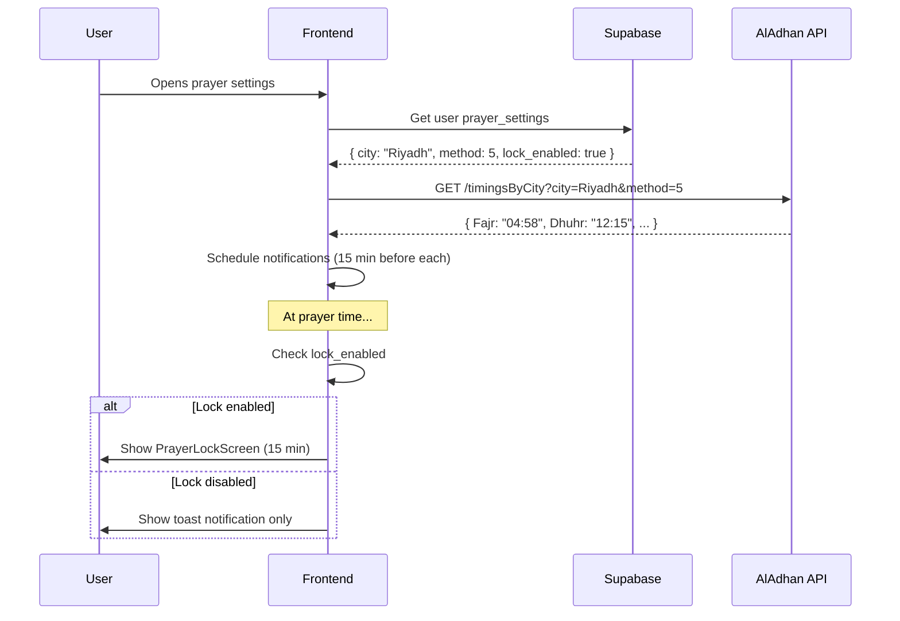

# Wireframes — Prayer Reminders Interface

## Overview

Complete UI for **Prayer Time Reminders** — a unique MENA-first feature that respects Islamic prayer times.

**Key Features:**
- Daily prayer times display
- Pre-prayer notification (15 min before)
- Optional screen lock (15 min during prayer)
- City/calculation method settings

---

## Prayer Times Widget (Dashboard)

```
┌─────────────────────────────────────────┐
│ 🕌 أوقات الصلاة — الرياض                │
├─────────────────────────────────────────┤
│                                         │
│ ┌─────────┬─────────┬─────────┐        │
│ │   🌅    │   ☀️    │   🌤️   │        │
│ │  الفجر  │  الظهر  │  العصر  │        │
│ │  04:58  │  12:15  │  15:28  │        │
│ └─────────┴─────────┴─────────┘        │
│                                         │
│ ┌─────────┬─────────┐                  │
│ │   🌅    │   🌙    │                  │
│ │ المغرب │  العشاء │                  │
│ │  17:52  │  19:22  │                  │
│ └─────────┴─────────┘                  │
│                                         │
│ الصلاة القادمة: العصر بعد 45 دقيقة     │
│ [⏰ تفعيل القفل] [⚙️ الإعدادات]       │
└─────────────────────────────────────────┘
```

**Component:** `PrayerTimesWidget.tsx`

**States:**
- **Normal:** يعرض الأوقات الخمسة
- **Next Prayer Active:** تمييز الصلاة القادمة (نص أكبر، خلفية ملونة)
- **Prayer Time:** تفعيل القفل (إذا مفعل)

---

## Prayer Settings Page

```
┌─────────────────────────────────────────────────────────────────┐
│ [← رجوع] إعدادات أوقات الصلاة                                   │
├─────────────────────────────────────────────────────────────────┤
│                                                                 │
│ ┌─────────────────────────────────────────────────────────────┐│
│ │ الموقع                                                      ││
│ │                                                             ││
│ │ المدينة الحالية                                             ││
│ │ ┌───────────────────────────────────────────────────┐       ││
│ │ │ الرياض، المملكة العربية السعودية            [📍] │       ││
│ │ └───────────────────────────────────────────────────┘       ││
│ │                                                             ││
│ │ [○ اكتشاف تلقائي] [● اختيار يدوي]                          ││
│ └─────────────────────────────────────────────────────────────┘│
│                                                                 │
│ ┌─────────────────────────────────────────────────────────────┐│
│ │ طريقة الحساب                                                ││
│ │                                                             ││
│ │ ┌───────────────────────────────────────────────────┐       ││
│ │ │ أم القرى (السعودية)                          [▼] │       ││
│ │ └───────────────────────────────────────────────────┘       ││
│ │                                                             ││
│ │ الخيارات:                                                   ││
│ │ • أم القرى (السعودية)                                      ││
│ │ • رابطة العالم الإسلامي                                    ││
│ │ • الجمعية الإسلامية لأمريكا الشمالية                       ││
│ │ • جامعة العلوم الإسلامية، كراتشي                           ││
│ │ • الهيئة المصرية للمساحة                                   ││
│ └─────────────────────────────────────────────────────────────┘│
│                                                                 │
│ ┌─────────────────────────────────────────────────────────────┐│
│ │ الإشعارات                                                   ││
│ │                                                             ││
│ │ تفعيل الإشعارات                             [───●] ON      ││
│ │                                                             ││
│ │ التنبيه قبل الأذان                                         ││
│ │ ┌───────────────────────────────────────────────────┐       ││
│ │ │ 15 دقيقة                                     [▼] │       ││
│ │ └───────────────────────────────────────────────────┘       ││
│ │                                                             ││
│ │ إشعار مخصص لكل صلاة:                                       ││
│ │ • الفجر      [───●] ON                                     ││
│ │ • الظهر      [───●] ON                                     ││
│ │ • العصر      [───●] ON                                     ││
│ │ • المغرب    [───●] ON                                     ││
│ │ • العشاء     [───●] ON                                     ││
│ └─────────────────────────────────────────────────────────────┘│
│                                                                 │
│ ┌─────────────────────────────────────────────────────────────┐│
│ │ شاشة القفل (اختياري)                                       ││
│ │                                                             ││
│ │ تفعيل شاشة القفل                            [───●] ON      ││
│ │                                                             ││
│ │ مدة القفل                                                   ││
│ │ ┌───────────────────────────────────────────────────┐       ││
│ │ │ 15 دقيقة                                     [▼] │       ││
│ │ └───────────────────────────────────────────────────┘       ││
│ │                                                             ││
│ │ ⚠️ سيتم تعطيل التفاعل مع المنصة خلال هذه الفترة            ││
│ │    يمكنك تجاوز القفل في حالات الطوارئ                      ││
│ └─────────────────────────────────────────────────────────────┘│
│                                                                 │
│                                              [حفظ الإعدادات]  │
└─────────────────────────────────────────────────────────────────┘
```

**Component:** `PrayerSettingsPage.tsx`

---

## Prayer Lock Screen (Full Screen Overlay)

```
┌─────────────────────────────────────────────────────────────────┐
│                                                                 │
│                                                                 │
│                                                                 │
│                                                                 │
│                          🕌                                     │
│                                                                 │
│                      وقت صلاة العصر                             │
│                                                                 │
│                       ༺⏰༻                                     │
│                                                                 │
│                   الوقت المتبقي: 12:45                         │
│                                                                 │
│                ████████████░░░░░░░░ 85%                        │
│                                                                 │
│                                                                 │
│          "إِنَّ الصَّلَاةَ كَانَتْ عَلَى الْمُؤْمِنِينَ        │
│                    كِتَابًا مَّوْقُوتًا"                        │
│                       — النساء: 103                             │
│                                                                 │
│                                                                 │
│                                                                 │
│        ┌─────────────────────────────────────────┐              │
│        │      [🚨 تجاوز في حالات الطوارئ]       │              │
│        └─────────────────────────────────────────┘              │
│                                                                 │
│                                                                 │
└─────────────────────────────────────────────────────────────────┘
```

**Component:** `PrayerLockScreen.tsx`

**Features:**
- Full screen overlay (z-index: 9999)
- Cannot click outside
- Countdown timer (15 min → 0)
- Progress bar
- Quranic verse rotation
- Emergency bypass (with confirmation)

**Code:**
```typescript
// src/components/prayer/PrayerLockScreen.tsx
export function PrayerLockScreen({ prayerName, durationMinutes = 15 }: Props) {
  const [remainingSeconds, setRemainingSeconds] = useState(durationMinutes * 60);
  const [showBypassConfirm, setShowBypassConfirm] = useState(false);
  
  useEffect(() => {
    const interval = setInterval(() => {
      setRemainingSeconds((prev) => {
        if (prev <= 1) {
          clearInterval(interval);
          onComplete();
          return 0;
        }
        return prev - 1;
      });
    }, 1000);
    
    return () => clearInterval(interval);
  }, []);
  
  const progress = ((durationMinutes * 60 - remainingSeconds) / (durationMinutes * 60)) * 100;
  const minutes = Math.floor(remainingSeconds / 60);
  const seconds = remainingSeconds % 60;
  
  return (
    <div className="fixed inset-0 z-[9999] bg-background flex items-center justify-center">
      <div className="text-center space-y-8">
        <div className="text-6xl">🕌</div>
        <h1 className="text-3xl font-bold">وقت صلاة {prayerName}</h1>
        
        <div className="text-5xl font-mono">
          {String(minutes).padStart(2, '0')}:{String(seconds).padStart(2, '0')}
        </div>
        
        <Progress value={progress} className="w-64 mx-auto" />
        
        <blockquote className="text-muted-foreground italic max-w-md">
          "إِنَّ الصَّلَاةَ كَانَتْ عَلَى الْمُؤْمِنِينَ كِتَابًا مَّوْقُوتًا"
          <footer className="mt-2">— النساء: 103</footer>
        </blockquote>
        
        <Button
          variant="ghost"
          size="sm"
          onClick={() => setShowBypassConfirm(true)}
        >
          🚨 تجاوز في حالات الطوارئ
        </Button>
      </div>
      
      {showBypassConfirm && (
        <BypassConfirmDialog
          onConfirm={onComplete}
          onCancel={() => setShowBypassConfirm(false)}
        />
      )}
    </div>
  );
}
```

---

## Pre-Prayer Notification

```
┌─────────────────────────────────────────┐
│ 🕌 تذكير بصلاة العصر                    │
│                                         │
│ صلاة العصر بعد 15 دقيقة                │
│ الوقت: 15:28                           │
│                                         │
│ [إغلاق]           [فتح إعدادات الصلاة] │
└─────────────────────────────────────────┘
```

**Implementation:** Browser Notification API + Toast

**Code:**
```typescript
// src/lib/prayerNotifications.ts
export async function showPrayerNotification(prayerName: string, time: string) {
  // Check permission
  if (Notification.permission === 'granted') {
    new Notification(`🕌 تذكير بصلاة ${prayerName}`, {
      body: `صلاة ${prayerName} بعد 15 دقيقة\nالوقت: ${time}`,
      icon: '/prayer-icon.png',
      tag: 'prayer-reminder'
    });
  }
  
  // Also show toast for in-app
  toast.info(`صلاة ${prayerName} بعد 15 دقيقة`, {
    duration: 30000, // 30 seconds
    action: {
      label: 'الإعدادات',
      onClick: () => navigate('/settings/prayer')
    }
  });
}
```

---

## Mobile View

```
┌───────────────────────┐
│ [←] أوقات الصلاة      │
├───────────────────────┤
│                       │
│ 📍 الرياض، السعودية   │
│                       │
│ ┌───────────────────┐ │
│ │ 🌅 الفجر   04:58 │ │
│ └───────────────────┘ │
│ ┌───────────────────┐ │
│ │ ☀️ الظهر   12:15 │ │
│ └───────────────────┘ │
│ ┌───────────────────┐ │
│ │ 🌤️ العصر  15:28 │ │ ← الصلاة القادمة
│ │   بعد 45 دقيقة    │ │    (highlighted)
│ └───────────────────┘ │
│ ┌───────────────────┐ │
│ │ 🌅 المغرب 17:52  │ │
│ └───────────────────┘ │
│ ┌───────────────────┐ │
│ │ 🌙 العشاء  19:22 │ │
│ └───────────────────┘ │
│                       │
│ [⚙️ الإعدادات]       │
│                       │
│ [Bottom Nav]          │
└───────────────────────┘
```

---

## Data Flow



---

## Database Schema

```sql
-- prayer_settings table
CREATE TABLE prayer_settings (
  user_id UUID PRIMARY KEY REFERENCES auth.users(id),
  city TEXT NOT NULL DEFAULT 'Riyadh',
  country TEXT NOT NULL DEFAULT 'Saudi Arabia',
  calculation_method INT NOT NULL DEFAULT 4, -- Umm al-Qura
  notification_enabled BOOLEAN DEFAULT true,
  notification_minutes_before INT DEFAULT 15,
  lock_enabled BOOLEAN DEFAULT false,
  lock_duration_minutes INT DEFAULT 15,
  prayers_enabled JSONB DEFAULT '{"fajr": true, "dhuhr": true, "asr": true, "maghrib": true, "isha": true}',
  created_at TIMESTAMPTZ DEFAULT NOW(),
  updated_at TIMESTAMPTZ DEFAULT NOW()
);

-- prayer_times_cache table
CREATE TABLE prayer_times_cache (
  city TEXT NOT NULL,
  country TEXT NOT NULL,
  date DATE NOT NULL,
  fajr TIME NOT NULL,
  dhuhr TIME NOT NULL,
  asr TIME NOT NULL,
  maghrib TIME NOT NULL,
  isha TIME NOT NULL,
  PRIMARY KEY (city, country, date)
);
```

---

## Next: Settings & Profile Wireframe

See [Wireframes-Settings-Profile.md](./Wireframes-Settings-Profile.md)
